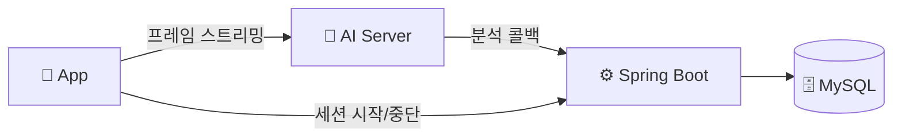
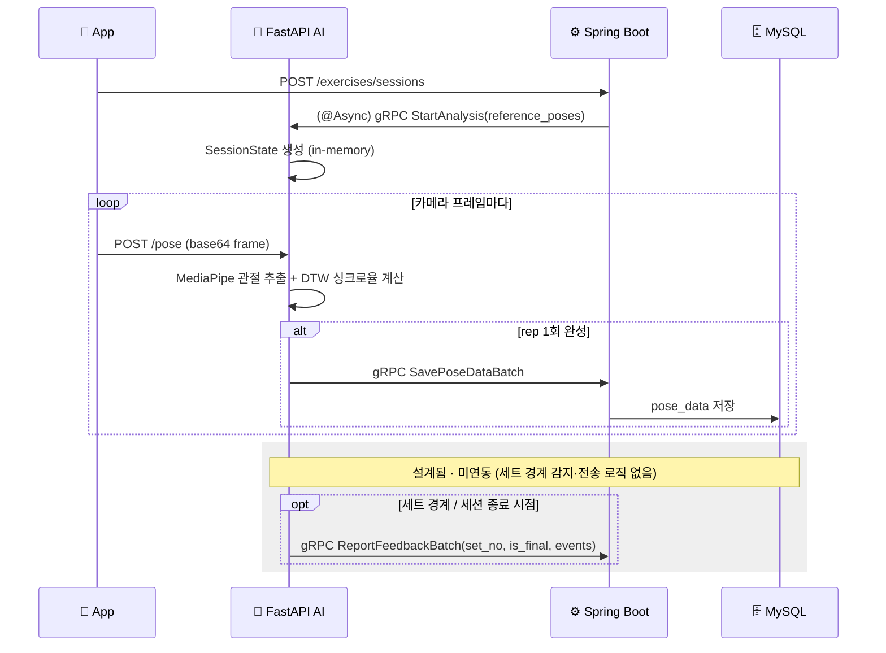

<div align="center">

# ShadowFit — AI Server (FastAPI)

**카메라로 찍은 운동 자세를, MediaPipe로 추출한 관절 좌표와 DTW(Dynamic Time Warping)로 기준 동작에 실시간 비교해 싱크로율과 피드백을 만들어내는 자세 분석 서버.**

</div>

---

## 이 레포에 대해

[ShadowFit](https://github.com/SMU-2026-1-capstone-project)은 3인 팀 캡스톤 프로젝트(React Native + Spring Boot + FastAPI)입니다. 이 레포는 그 팀 프로젝트의 개인 포크로, **AI 서버(FastAPI) 모듈**을 담고 있습니다. 이 레포는 [Shadowfit/init](https://github.com/Shadowfit/init) 모노레포의 `ai-server/` 모듈이 자동으로 미러링된 것이며, 전체 구조는 [조직 프로필](https://github.com/Shadowfit)을 참고하세요.

---

## 🧩 아키텍처



카메라 프레임은 프론트에서 AI 서버로 직접 스트리밍되고, 분석 결과는 gRPC 콜백으로 Spring에 전달됩니다.

## 🔁 세션 시작 & 실시간 분석 시퀀스



프레임마다 rep 완성 여부를 판단해 완성된 rep만 Spring에 배치로 콜백합니다. TTS 발화 이벤트 배치(`ReportFeedbackBatch`)는 Spring 쪽 계약은 완료됐지만 AI 서버의 세트 경계 감지·전송 로직은 아직 구현 전입니다.

## 실행 방법

```bash
cp .env.example .env   # 값 채우기
pip install -r requirements.txt
uvicorn app.main:app --reload
```

FastAPI(HTTP)와 gRPC 서버가 같은 프로세스에서 백그라운드 스레드로 함께 뜹니다.

## 주요 기능

- MediaPipe로 영상에서 관절 좌표를 실시간 추출
- DTW로 사용자 동작과 스타일별 기준 동작을 비교해 싱크로율/구간별 정확도 산출
- Backend ↔ AI Server gRPC 통신 (분석 요청 수신 → 결과 콜백 전송)
- 내부 API 토큰 기반 인증 미들웨어(`InternalAuthMiddleware`)로 Backend 외 호출 차단

## 🛠 기술 스택


---

<div align="center">

팀 프로젝트 원본은 [SMU-2026-1-capstone-project](https://github.com/SMU-2026-1-capstone-project)에서 확인할 수 있습니다.

</div>
