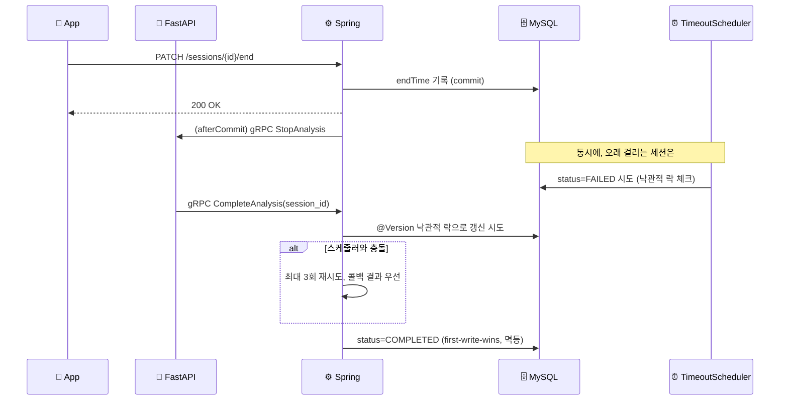

# ShadowFit — Backend (Spring)

**"시계열 쓰기-헤비 워크로드 위에서, 두 서비스에 걸친 운동 세션 상태를 동시성 정합성 있게 관리하고, 그 데이터 계층을 production 기준으로 깊게 엔지니어링한 백엔드."**

---

## 이 레포에 대해

[ShadowFit](https://github.com/SMU-2026-1-capstone-project)은 3인 팀 캡스톤 프로젝트(React Native + Spring Boot + FastAPI)입니다. 이 레포는 그 팀 프로젝트의 개인 포크로, **제가 담당한 백엔드(Spring) 작업과 DB 엔지니어링 실험을 정리**했습니다

---

## 🎯 헤드라인 — 운동 세션 생명주기의 분산 정합성

**문제**: 운동 세션 상태가 Spring(Java)과 FastAPI(Python) 두 서비스에 걸쳐 있습니다. 세션 종료 시점에 서로 다른 두 주체가 같은 레코드를 동시에 건드릴 수 있습니다.
- **타임아웃 스케줄러**(`SessionTimeoutScheduler`): "너무 오래 안 끝남 → `FAILED`"
- **FastAPI 완료 콜백**(gRPC `CompleteAnalysis`): "분석 끝남 → `COMPLETED`"

**해결**(실제 코드):
- **afterCommit 외부 호출** — DB 커밋이 확정된 뒤에만 AI에 gRPC를 쏩니다(`SessionService.endSession`이 `TransactionSynchronization.afterCommit`에서 `analysisService.stopAnalysis` 호출). 트랜잭션 안에 외부 호출이 끼지 않게 하는 원칙입니다.
- **`@Version` 낙관적 락** — `Session` 엔티티에 버전 컬럼을 두고, 스케줄러와 콜백이 동시에 갱신을 시도하면 낙관적 락 예외로 충돌을 감지합니다. `completeSession`은 충돌 시 최대 3회 재시도하고, 콜백(AI) 결과를 우선시합니다.
- **멱등 수신** — `applyComplete`는 이미 `COMPLETED`인 세션이면 즉시 반환(first-write-wins). 네트워크 재시도로 같은 콜백이 중복 도착해도 안전합니다.

**직접 재현·검증**: 같은 패턴(동시 read-modify-write)을 별도 스크립트로 재현해, naive read-modify-write는 갱신이 유실(commit 순서에 따라 두 값 중 하나만 남음)되지만 원자적 UPDATE·비관적 락(`SELECT ... FOR UPDATE`)·낙관적 락(CAS) 세 가지 방식은 모두 정확한 값을 복구함을 `performance_schema.data_locks`로 락 상태까지 관찰해 확인했습니다. MVCC 격리수준(REPEATABLE READ vs READ COMMITTED vs SERIALIZABLE)도 같은 방식으로 비교해, RC만으로는 lost-update를 막지 못한다는 것과 SERIALIZABLE이 읽기까지 잠가 직렬화 비용을 만든다는 것을 직접 관찰했습니다.

> **"동시성 처리했어요"가 아니라, 왜 낙관적 락을 골랐는지(저경합·블로킹 회피)를 실험으로 증명하는 쪽입니다.** 남들이 흔한 "선착순 쿠폰" 예제로 동시성을 붙일 때, 이 프로젝트는 두 서비스 경계에서 동시성 문제가 도메인 자연스럽게 발생했고, 그걸 발동/미발동으로 갈라 측정했다는 점이 차이입니다.

---

## 🔬 DB 엔지니어링 실험 (RealMySQL 8.0 기준)

전제: DAU 1,000명을 가정한 합성 데이터로 `pose_data` 테이블에 **1억 행(133,334세션 × 750행, ~11GB)**을 시딩해 실험했습니다. 절대 처리량 숫자는 개발 환경(물리 2코어) 종속이라 신뢰하지 않고, **메커니즘과 상대적 개선폭(before/after)만 근거로 인용**합니다.

| 실험 | 발견 | 수치 |
| :--- | :--- | :--- |
| **인덱스 검증** | "인덱스 추가하면 빨라진다"는 가설을 먼저 세웠으나, `EXPLAIN ANALYZE`로 이미 최적(covering index, filesort 없음)임을 확인하고 가설을 폐기. 강제 풀스캔과 대조해 인덱스의 실제 역할을 검증 | 인덱스 스캔 vs 강제 풀스캔 **4.1M 행 = 85초** |
| **배치 INSERT** | `JdbcTemplate.batchUpdate`로 전환(JPA `saveAll`은 `IDENTITY` PK 때문에 Hibernate batch가 원천 차단되는 걸 확인 후 우회) | throughput **+99%**, p99 **−37%** |
| **Projection (JSON off-page)** | 리포트 조회가 쓰지도 않는 JSON 컬럼(2.3KB)까지 통째로 로드하고 있었음. JSON이 InnoDB off-page(오버플로우 페이지)에 저장돼 추가 랜덤 I/O가 발생한다는 걸 확인하고 3컬럼 projection으로 전환 | payload **1,716.8KB → 22.4KB (−98.7%)**, 쿼리 **12.1ms → 1.5ms** |
| **페이지네이션 (offset vs keyset)** | 1억 행 위에서 offset은 깊이에 비례해 선형으로 느려지고(O(N)), keyset(cursor)은 깊이와 무관하게 평탄함을 실측 | offset 5,000만 지점 **26초** vs keyset **0.05ms** |
| **파티셔닝 (TTL 용도)** | "1억 행이니까 파티션"이 아니라, 세션 단위 조회는 파티션 pruning 이득이 0임을 먼저 확인(정직한 반증). 유일한 정당화는 오래된 raw 데이터를 버리는 TTL 용도 | 동일 ~800만 행 만료: `DELETE` **18.6분**(빈 파일 잔존) vs `DROP PARTITION` **1.8초** |
| **버퍼풀 / read-ahead 함정** | 순차 스캔에서 InnoDB read-ahead가 표준 hit율 공식(1−reads/read_requests)을 왜곡해 거짓으로 99%대를 보여준다는 걸 발견. 실제 물리 I/O는 바이트 단위 지표로 봐야 함을 확인 | 작업셋(540MB) > 버퍼풀(128MB) → warm에도 매번 ~485MB 재읽기 |
| **JSON 트림** | MediaPipe가 33개 관절을 전부 저장하지만 실제 사용은 13개뿐인 것을 코드로 확인, 사용 컬럼만 추출 | 평균 페이로드 **2,344B → 916B (−60.9%)** |

> 정직한 한계: 합성 데이터가 단일 템플릿 복제라 **값 분포(카디널리티)는 균일**합니다. 행수·payload 크기 의존 실험(위 표)은 유효하지만, 값 분포에 의존하는 실험(선택도, 옵티마이저 카디널리티 추정)은 의도적으로 수행하지 않았습니다.

---

## 🛡 보강 축 — 정직하게 인지하고 있는 갭

컴포넌트별 실패 모드를 먼저 카탈로그화(트리거 → blast radius → 감지 → 현재 완화 → 갭)한 뒤, 그 갭을 보강 우선순위로 정리했습니다.

| 축 | 현재 상태 |
| :--- | :--- |
| **신뢰성(전달 의미론)** | 🔶 멱등 수신은 있지만(재전송 안전), 세션 종료 통보(afterCommit gRPC)는 fire-and-forget(`onError` 로그만) — **at-most-once**라 유실 가능. Outbox 패턴으로 at-least-once 송신 + 기존 멱등 수신 = exactly-once 전환이 다음 과제 |
| **회복탄력성** | 🔶 gRPC 호출에 deadline·서킷브레이커 없음 — AI 서버가 느려지거나 죽으면 그대로 영향받을 수 있음 |
| **관측성** | 🔴 구조화 로깅·correlation id 전파·헬스체크 메트릭이 비어있음 |
| **캐싱** | 🔶 설계만 완료(카탈로그성 데이터는 cache-aside + Caffeine, 다중 인스턴스 시 Redis로 전환) — 아직 미구현 |
| **보안** | 🟢 JWT + Refresh Token + blacklist + BCrypt + role 기반 인가 |

> "다 막았다"가 아니라 **"뭐가 어떻게 깨지는지 알고, 뭘 아직 안 막았는지 정직하게 아는 것"**이 이 표의 목적입니다.

---

## ⚠️ 정직한 포지셔닝

- **substrate 구분** — MediaPipe 자세 추출·DTW 비교·TTS는 이 앱의 기능이지 제 백엔드 실력 증명 대상이 아닙니다. 위 내용은 전부 Spring/MySQL 영역입니다.
- **DAU 1,000 가정** — "동시 사용자가 적어서 드물다"로 회피하지 않고, DAU 1,000명이라는 구체적 가정을 못박은 뒤 그 기준으로 동시성·부하를 설계했습니다. 다만 이건 정합성 메커니즘을 증명하기 위한 가정이지, "N 동시 부하 TPS 실측"을 자랑하는 것과는 구분합니다(단일 클라이언트 측정).
- **합성 데이터 한계** — 값 분포가 균일한 합성 데이터라는 한계를 알고, 분포에 의존하는 실험은 하지 않았습니다.
- **개발 환경 제약** — 로컬 물리 2코어(i3-6100) 환경에 MySQL·백엔드·부하 생성기가 동거하기 때문에, 절대 RPS·처리량 수치는 그 환경에 종속적입니다. 위에서 인용한 수치는 절대치가 아니라 **메커니즘과 상대적 개선폭(before/after)**으로만 신뢰해 주세요.
- **MySQL을 쓰는 이유** — "이 워크로드가 MySQL에 기술적으로 유리해서"라는 주장 세 가지(클러스터드 인덱스, 파티션 DROP, JSON off-page)를 스스로 검토했는데, 전부 PostgreSQL도 동등한 매커니즘(힙 테이블 자연 append, 선언적 파티셔닝 DETACH+DROP, TOAST)을 가진다는 걸 확인해 과장이었음을 인정합니다. MySQL을 유지하는 진짜 이유는 기술 우위가 아니라 이미 이 수치들로 실측·문서화된 자산이 있고, 국내 백엔드 신입 채용에서 흔히 쓰이는 스택이기 때문입니다.

---

## 🛠 기술 스택

**적재/부하 측정**: `ghz`(gRPC 부하), `performance_schema`/`sys`(락·I/O 관측), `EXPLAIN ANALYZE`

---

팀 프로젝트 원본은 [SMU-2026-1-capstone-project](https://github.com/SMU-2026-1-capstone-project)에서 확인할 수 있습니다.

