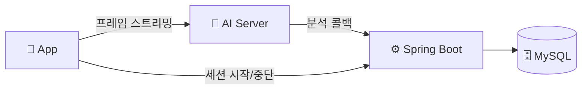
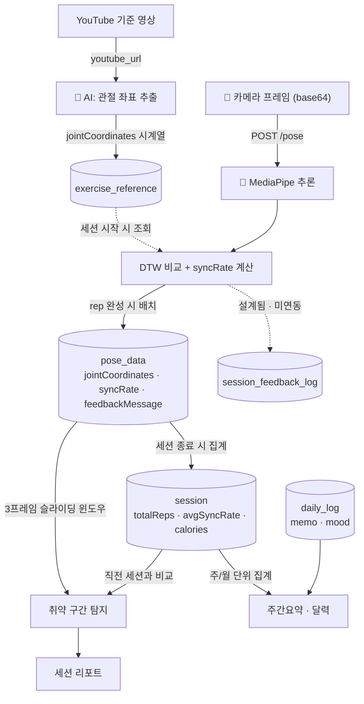
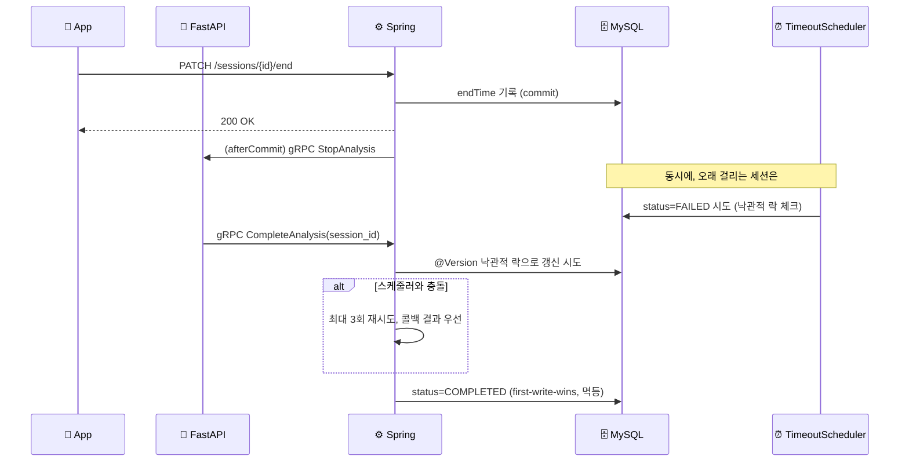

# ShadowFit — Backend (Spring)

**"시계열 쓰기-헤비 워크로드 위에서, 두 서비스에 걸친 운동 세션 상태를 동시성 정합성 있게 관리하고, 그 데이터 계층을 production 기준으로 깊게 엔지니어링한 백엔드."**

---

## 🛠 기술 스택

**적재/부하 측정**: `ghz`(gRPC 부하), `performance_schema`/`sys`(락·I/O 관측), `EXPLAIN ANALYZE`

---

## 🧩 아키텍처

프론트는 카메라 프레임을 AI 서버에 직접 스트리밍하고, AI 서버는 gRPC 콜백으로 결과를 Spring에 전달합니다. 세션 시작/중단만 프론트→Spring→AI로 한 단계 거칩니다.

## 🔀 데이터 플로우

카메라 프레임은 AI 서버 내부에서 관절 좌표로 변환된 뒤 rep 단위로만 Spring에 저장되고, 세션 리포트·주간요약·달력은 모두 이 `pose_data`/`session` 테이블에서 파생됩니다.

## 🔌 대표 API

| Method | Endpoint | 설명 |
| :--- | :--- | :--- |
| `POST` | `/exercises/sessions` | 운동 세션 시작 (DB 생성 후 202 즉시 응답, gRPC 송신은 비동기) |
| `PATCH` | `/sessions/{sessionId}/end` | 세션 종료 (단일 엔드포인트, 커밋 후 AI에 비동기 통보) |
| `POST` | `/exercises/{exerciseId}/reference` | YouTube 기준 동작 좌표 추출 요청 |
| `GET` `PATCH` | `/preferences/tts` | TTS 사용 여부·속도 조회/변경 |
| `GET` | `/exercises/{exerciseId}/feedback-templates` | 운동별 피드백 멘트 조회 |
| `GET` | `/reports/calendar` | 달력 기반 월별 운동 기록 |
| `GET` | `/reports/weekly-summary` | 주간 활동 요약 |
| `POST` | `/reports/daily-logs` | 운동 일지 작성 |
| `GET` | `/reports/session/{sessionId}` | 세션별 상세 리포트(취약 구간·이전 세션 비교) |
| `PATCH` | `/admin/exercises/{exerciseId}/thresholds` | 페르소나별 싱크로율 임계값 조정 (관리자) |

전체 스펙은 로컬 기동 후 Swagger(`/swagger-ui`)에서 확인할 수 있습니다.

---

## 🎯 헤드라인 — 운동 세션 생명주기의 분산 정합성

**문제**: 운동 세션 상태가 Spring(Java)과 FastAPI(Python) 두 서비스에 걸쳐 있습니다. 세션 종료 시점에 서로 다른 두 주체가 같은 레코드를 동시에 건드릴 수 있습니다.
- **타임아웃 스케줄러**(`SessionTimeoutScheduler`): "너무 오래 안 끝남 → `FAILED`"
- **FastAPI 완료 콜백**(gRPC `CompleteAnalysis`): "분석 끝남 → `COMPLETED`"

**해결**(실제 코드):
- **afterCommit 외부 호출** — DB 커밋이 확정된 뒤에만 AI에 gRPC를 쏩니다(`SessionService.endSession`이 `TransactionSynchronization.afterCommit`에서 `analysisService.stopAnalysis` 호출). 트랜잭션 안에 외부 호출이 끼지 않게 하는 원칙입니다.
- **`@Version` 낙관적 락** — `Session` 엔티티에 버전 컬럼을 두고, 스케줄러와 콜백이 동시에 갱신을 시도하면 낙관적 락 예외로 충돌을 감지합니다. `completeSession`은 충돌 시 최대 3회 재시도하고, 콜백(AI) 결과를 우선시합니다.
- **멱등 수신** — `applyComplete`는 이미 `COMPLETED`인 세션이면 즉시 반환(first-write-wins). 네트워크 재시도로 같은 콜백이 중복 도착해도 안전합니다.

**직접 재현·검증**: 같은 패턴(동시 read-modify-write)을 별도 스크립트로 재현해, naive read-modify-write는 갱신이 유실(commit 순서에 따라 두 값 중 하나만 남음)되지만 원자적 UPDATE·비관적 락(`SELECT ... FOR UPDATE`)·낙관적 락(CAS) 세 가지 방식은 모두 정확한 값을 복구함을 `performance_schema.data_locks`로 락 상태까지 관찰해 확인했습니다. MVCC 격리수준(REPEATABLE READ vs READ COMMITTED vs SERIALIZABLE)도 같은 방식으로 비교해, RC만으로는 lost-update를 막지 못한다는 것과 SERIALIZABLE이 읽기까지 잠가 직렬화 비용을 만든다는 것을 직접 관찰했습니다.

---

## 🔬 DB 엔지니어링 실험

전제: DAU 1,000명을 가정한 합성 데이터로 `pose_data` 테이블에 **1억 행(133,334세션 × 750행, ~11GB)**을 로컬(더미 JSON)에 시딩해 실험했고, 핵심 결과는 AWS EC2(m6i.xlarge)에서 **실제 2.3KB JSON × 실제 1억 행**으로 재검증했습니다. 절대 처리량 숫자는 개발 환경 종속이라 신뢰하지 않고, **메커니즘과 상대적 개선폭(before/after)만 근거로 인용**합니다.

| 실험 | 발견 | 수치 |
| :--- | :--- | :--- |
| **인덱스 검증** | "인덱스 추가하면 빨라진다"는 가설을 세웠으나 `EXPLAIN ANALYZE`로 이미 최적(covering index, filesort 없음)임을 확인해 폐기. `IGNORE INDEX`로 강제 풀스캔과 직접 대조(`SET profiling`, wall-clock 오염 배제) | 실제 2.1KB payload 기준 인덱스 있음 vs 강제 풀스캔 **약 9,000배**(412만 행). 1억 행 재검증 시 풀스캔 **2,120.9초**까지 O(N) 선형 확인 |
| **배치 INSERT** | `JdbcTemplate.batchUpdate`로 전환(JPA `saveAll`은 `IDENTITY` PK 때문에 Hibernate batch가 원천 차단되는 걸 확인 후 우회) | throughput **+99%**, p99 **−37%** |
| **Projection (JSON off-page)** | 리포트 조회가 안 쓰는 JSON 컬럼(2.3KB)까지 로드하고 있었음. off-page(오버플로우 페이지) 랜덤 I/O를 3컬럼 projection으로 회피. AWS(m6i.xlarge)에서 실제 1억 행 × 실제 2.3KB JSON으로 재검증 | payload **1,740.1KB → 22.6KB (−98.7%)**, warm 쿼리 **40.6ms → 1.4ms**(최대 41배). 세션 종료 시 1회 도는 비동기 precompute라, 개선 의미는 체감 지연 감소가 아니라 배치 잡 자원 소모 감소 |
| **페이지네이션 (offset vs keyset)** | 1억 행에서 offset은 깊이에 비례해 선형으로 느려지고(O(N)), keyset(cursor)은 깊이와 무관하게 평탄함을 실측. 실제 JSON(2.3KB)으로 재검증하면 페이지당 행 수가 줄어 저하폭이 더 커짐 | 더미 데이터 offset 5,000만 지점 **26초** vs 실제 JSON 동일 지점 **941초**(약 36배 악화). keyset은 두 경우 모두 0.05ms대 평탄 |
| **파티셔닝 + FK 트레이드오프** | "1억 행이니까 파티션"이 아니라 세션 단위 조회는 pruning 이득 0임을 먼저 반증. 유일한 정당화는 TTL(오래된 raw 폐기). MySQL/InnoDB가 FK+파티션을 동시지원 안 해서(`ERROR 1506`) FK를 제거하고 대체로 비동기 정리 서비스(`PoseDataCleanupService`)를 설계해 실스키마에 반영 | `DROP PARTITION` vs `DELETE` 로컬 대조 **약 421~625배**. TTL 자동 만료 스케줄러(`@Scheduled`)는 아직 미구현, 스키마·정리 로직만 완료 |
| **버퍼풀 / read-ahead 함정** | 순차 스캔에서 InnoDB read-ahead가 표준 hit율 공식(1−reads/read_requests)을 왜곡해 거짓으로 99%대를 보여줌. AWS(m6i.xlarge, 실제 2.3KB JSON)로 재검증 | 로컬: 작업셋(540MB) > 버퍼풀(128MB) → warm에도 매번 ~485MB 재읽기. AWS: 작업셋(8.19GB)이 버퍼풀(2GB)보다 크면 cold 675.2초 vs warm 675.85초(캐시 이득 0), 작업셋(19MB)이 버퍼풀보다 작으면 warm 0.461초·디스크 0바이트(3.4배). naive hit율 공식은 95.36%로 나오지만 실제 물리 I/O는 cold·warm 동일 |
| **JSON 트림** | MediaPipe가 33개 관절을 전부 저장하지만 실제 사용은 13개뿐인 것을 코드로 확인, 사용 컬럼만 추출 | 평균 페이로드 **2,344B → 916B (−60.9%)** |

---

## 🛡 보강 축 — 정직하게 인지하고 있는 갭

컴포넌트별 실패 모드를 먼저 카탈로그화(트리거 → blast radius → 감지 → 현재 완화 → 갭)한 뒤, 그 갭을 보강 우선순위로 정리했습니다.

| 축 | 현재 상태 |
| :--- | :--- |
| **신뢰성(전달 의미론)** | 🔶 멱등 수신은 있지만(재전송 안전), 세션 종료 통보(afterCommit gRPC)는 fire-and-forget(`onError` 로그만) — **at-most-once**라 유실 가능. Outbox 패턴으로 at-least-once 송신 + 기존 멱등 수신 = exactly-once 전환이 다음 과제 |
| **회복탄력성** | 🔶 gRPC 호출에 deadline·서킷브레이커 없음 — AI 서버가 느려지거나 죽으면 그대로 영향받을 수 있음 |
| **관측성** | 🔴 구조화 로깅·correlation id 전파·헬스체크 메트릭이 비어있음 |
| **캐싱** | 🔶 설계만 완료(카탈로그성 데이터는 cache-aside + Caffeine, 다중 인스턴스 시 Redis로 전환) — 아직 미구현 |
| **보안** | 🟢 JWT + Refresh Token + blacklist + BCrypt + role 기반 인가 |

> "다 막았다"가 아니라 **"뭐가 어떻게 깨지는지 알고, 뭘 아직 안 막았는지 정직하게 아는 것"**이 이 표의 목적입니다.

