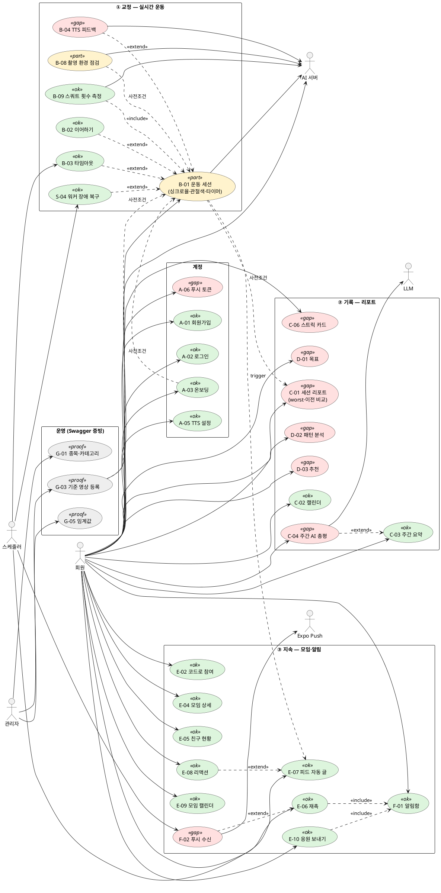

# 제품 전체 시나리오 → 유스케이스 → 남은 구현

작성 2026-09-21 · 갱신 2026-09-23. 상태: **§6 미팅 2회 배분 확정(2026-09-23 사용자 confirm).**
입력: 1학기 발표 PDF(HO-PT 5·6·9·10쪽), `docs/PRD.md`, [`../usecase/README.md`](../usecase/README.md)(09-23 통합판), `tasks/34-user-test-scenario.md`. 코드 대조는 `main` 731f2274(09-22) · 프론트 `frontend/app` 09-21.

> 교수님 지시(09-21) — «유스케이스 사례 / 시연 시나리오 기반 빠진 거만 개발». 이 문서는 그 세 단계를 순서대로 밟는다: **§2 제품 전체 시나리오 → §3·4 거기서 도출한 유스케이스 → §6 시나리오가 밟는데 안 된 것 = 남은 미팅 2회의 개발 목록.**
> 34번 문서는 소셜 L1 사용자 테스트 설계라 PDF 핵심(실시간 피드백·리포트)이 빠져 있다 — 그 문서를 대체하지 않고, 시연 대본은 이 문서가 맡는다.

---

## 1. 제품 컨셉 — 시나리오의 뼈대

PDF 5쪽 목표: *«오프라인 PT 의 고비용과 홈트의 부정확한 자세 교정 문제를 해소하는, AI 실시간 모션 코칭 + 피드백 보이스의 양방향 AI 운동 코칭 플랫폼»*. 검증 계획 세 줄이 곧 제품의 세 축이다.

| 축 | PDF 검증 계획 | 제품 기능 | 시기 |
|---|---|---|---|
| **① 교정** | 동작 교정 정확도·안전성 | 기준 영상 대비 DTW 싱크로율 → 색·TTS 로 즉시 피드백. 화면을 안 봐도 되는 게 차별점(4쪽 Exercite 비판) | 1학기 |
| **② 기록** | 운동 능력 향상·목표 달성률 | 세션 리포트(worst 구간·이전 비교) · 캘린더 · 주간 요약 · AI 총평 · 목표 · 패턴 · 추천 | 1학기 + 방학 |
| **③ 지속** | 단순 영상 시청 대비 **운동 지속성** | 모임 · 친구 현황 · 재촉 · 피드 · 스트릭 · 알림 | **2학기 신규** — PDF 검증 계획 3번을 구현한 것 |
| (운영) | — | 관리자 카탈로그·기준 영상·임계값·통계, 트레이너 모니터링 | 방학 |

2학기 소셜은 PDF 밖 기능이 아니라 **PDF 5쪽 «지속성» 검증 항목의 구현**이다 — 발표에서 이렇게 붙인다.

---

## 2. 전체 시나리오 — 일주일

등장인물(가상): **지수**(헬린이 페르소나, 첫 사용자) · **민호**(같은 모임, 먼저 쓰던 사람) · **운영자**(ADMIN) · 트레이너(부록).
열: 화면 = 프론트에 그 단계를 밟을 화면이 있나 · UC = §3 유스케이스 ID · 상태 = 시연 가능 여부(✅ 됨 / ⚠️ 부분 / ❌ 안 됨).

### P. 사전 준비 (운영자, 시연 전날)

| # | 단계 | 화면 | API | UC | 상태 |
|:--:|---|:--:|---|---|:--:|
| P-1 | 카테고리·운동 카탈로그 등록 (스쿼트, 런지·플랭크는 «준비 중») | ❌ | `/admin/categories` · `/admin/exercises` | G-01 | ⚠️ Swagger 로 |
| P-2 | 스쿼트 기준 영상 등록 → AI 관절 추출 → 기준 좌표 저장 | ❌ | `POST /admin/exercises/{id}/reference-video` → gRPC `ExtractReferenceData` | G-03 | ⚠️ Swagger 로 |
| P-3 | 페르소나별 싱크로율 임계값 확인 (헬린이 60%) | ❌ | `PATCH /admin/exercises/{id}/thresholds` | G-05 | ⚠️ Swagger 로 |
| P-4 | 모임 «캡스톤 스쿼트단» 생성, 초대 코드 인쇄, 민호 소속 + 며칠치 COMPLETED 이력 시드 | — | 시드 SQL (34 §5) | E-01 | ✅ |

### D0. 지수 — 진입 (10분)

| # | 단계 | 화면 | API | UC | 상태 |
|:--:|---|:--:|---|---|:--:|
| 0-1 | 앱 설치 → 회원가입 → 로그인 | ✅ | `POST /member/signup` · `/login` | A-01·A-02 | ✅ |
| 0-2 | 온보딩: 페르소나 «헬린이», 키/몸무게, 기준 영상 선택 | ✅ | `PATCH /member/onboarding/{email}` | A-03 | ✅ |
| 0-3 | 홈: 이번 달 캘린더(빈), 연속 0일, «최신 모임 운동 현황» 비어 있음 | ✅ | `GET /reports/calendar` · `GET /friends` | C-02·E-05 | ✅ |
| 0-4 | 모임 탭 → 초대 코드 입력 → 참여 → 모임 상세에 민호가 보임 | ✅ | `POST /groups/join` · `GET /groups/{id}` | E-02·E-04 | ✅ |
| 0-5 | 푸시 권한 허용 → 토큰 등록 | ❌ | `POST /push-tokens` | A-06 | ❌ `expo-notifications` 미설치 |
| 0-6 | 마이페이지: TTS 켜짐·속도 확인, 온보딩 정보 수정 가능 | ✅ | `GET·PATCH /preferences/tts` · 온보딩 PATCH | A-05·A-03 | ✅ (설정만 — 재생은 1-4) |

### D1. 지수 — 첫 운동 (핵심, 5분)

| # | 단계 | 화면 | API | UC | 상태 |
|:--:|---|:--:|---|---|:--:|
| 1-1 | 운동 탭 → 스쿼트 → 시작. 세션 ID·워커 즉시 반환, AI 에 `StartAnalysis` | ✅ | `POST /exercises/sessions` | B-01 | ✅ |
| 1-2 | 카메라 세팅. 전신이 안 잡히면(유효 프레임 70% 미만) **음성으로** «뒤로 물러나 주세요» | ⚠️ | AI `POST /pose` → cue | B-08·B-04 | ⚠️ 토스트만, 음성 없음 |
| 1-3 | 스쿼트 수행: rep 자동 카운트, 싱크로율 실시간 표시, **관절이 초록/주황/빨강으로**, 경과 시간 | ⚠️ | AI `/pose` 응답 · gRPC `SavePoseDataBatch` | B-01·B-09 | ⚠️ rep·싱크로율·3색 글로우 ✅ / **관절 오버레이 ❌ · 타이머 ❌** |
| 1-4 | 무릎이 안쪽으로 → 빨강 + **TTS «무릎을 바깥으로»**. 화면 안 보고도 교정 | ❌ | cue → 템플릿(`GET /exercises/{id}/feedback-templates`) → `expo-speech` | B-04 | ❌ **`expo-speech` 설치만, 호출 없음** — 결함 토스트만 |
| 1-5 | 종료 → `end` → 아웃박스 `STOP_ANALYSIS` → AI `CompleteAnalysis` → COMPLETED | ✅ | `PATCH /sessions/{id}/end` | B-01·S-01 | ✅ |
| 1-6 | 세션 리포트: 평균 싱크로율·rep 수·시간, rep 별 추이, **worst 구간(몇 회차·왜)**, 첫 세션이라 이전 비교 없음 | ⚠️ | `GET /reports/session/{id}` | C-01 | ❌ **화면이 `MOCK_REPORT` 상수** — API 미연결 |
| 1-7 | 모임 피드에 «지수님이 스쿼트 완료» 자동 글 | ✅ | 아웃박스 `SESSION_COMPLETED` → `GET /groups/{id}/feed` | E-07 | ✅ |
| 1-8 | 민호가 그 글에 리액션 👍 | ✅ | `PUT /groups/{id}/events/{seq}/reactions/{kind}` | E-08 | ✅ |

### D2. 지수가 안 함 → 민호가 재촉 (3분)

| # | 단계 | 화면 | API | UC | 상태 |
|:--:|---|:--:|---|---|:--:|
| 2-1 | 민호 홈 «친구 현황»: 지수 «오늘 안 함» → 재촉 버튼 | ✅ | `GET /friends` · `POST /friends/{id}/nudge` | E-05·E-06 | ✅ |
| 2-1′ | (같은 카드의) 응원 메시지 보내기 | ✅ | `POST /friends/{id}/cheer` | E-10 | ✅ 09-21 팀원이 API(V24)·화면 추가 (`f8fc8514`) |
| 2-2 | 지수 폰에 푸시 «민호님이 재촉했어요» | ❌ | 아웃박스 `PUSH_NOTIFICATION` → Expo Push | F-02 | ❌ (0-5 에 막힘) |
| 2-3 | 지수 알림함 → 읽음 | ✅ | `GET /notifications` · `PATCH …/read` | F-01 | ✅ — 푸시 없어도 여기서 성립 |
| 2-4 | 지수 운동(1-1~1-5) → 리포트에 **이전 세션 대비 +N%** | ⚠️ | `comparisonWithPrevious` | C-01 | ❌ (1-6 과 동일) |

### D3. 장애 변형 (시연에선 한 개만 골라 보여줌)

| # | 단계 | UC | 상태 |
|:--:|---|---|:--:|
| 3-1 | 세션 중 전화 옴 → 앱 백그라운드 → 복귀 → «이어하기» → AI 상태 복구 | B-02 | ✅ |
| 3-2 | 앱을 그냥 닫음 → 1분 주기 스케줄러가 예상시간+30분 뒤 FAILED → 출석 안 생김 | B-03 | ✅ (로그로 증빙) |
| 3-3 | AI 워커 재시작 → 서킷 OPEN → `REATTACH_ANALYSIS` 로 자동 재부착 | S-04 | ✅ (로그로 증빙) — 발표 어필 포인트 |

### D7. 주말 결산 (5분)

| # | 단계 | 화면 | API | UC | 상태 |
|:--:|---|:--:|---|---|:--:|
| 7-1 | 활동 탭: 이번 주 운동 일수·총 분·평균 싱크로율 | ✅ | `GET /reports/weekly-summary` | C-03 | ✅ |
| 7-2 | 스트릭 카드: 현재 N일·최장 M일·이번 주 7칸 | ❌ | `GET /attendance/mine` | C-06 | ❌ 홈에 «연속 N일» 숫자만(캘린더 응답의 `consecutiveDays`), 카드 없음 |
| 7-3 | 지난주 리포트 — 집계 + **AI 총평(Gemini)** | ❌ | `GET /reports/weekly-report?week=` | C-04 | ❌ 화면 없음 |
| 7-4 | 모임 출석 캘린더 — 날짜별 몇 명이 했나 | ✅ | `GET /groups/{id}/attendance` | E-09 | ✅ |
| 7-5 | 목표(«주 3회») 진척 | ❌ | `/goals` | D-01 | ❌ 화면 없음 |
| 7-6 | 패턴 분석(주기성·강도 추세·꾸준함) → 다음 세션 추천 | ❌ | `/patterns/*` · `/recommendations/next-session` | D-02·D-03 | ❌ 화면 없음 |
| 7-7 | 오늘 메모·기분 | ✅ | `POST /reports/daily-logs` | C-05 | ✅ |

### X. 부록 — 운영·트레이너 (시연 경로 밖, 백엔드 증빙)

| # | 단계 | UC | 상태 |
|:--:|---|---|:--:|
| X-1 | 운영자: 대시보드 통계·회원·세션 목록 | G-06 | ⚠️ Swagger |
| X-2 | 트레이너: 담당 회원 세션을 SSE 로 실시간 관전 | H-01 | ⚠️ curl |
| X-3 | 모임 화면 열어둔 채 재촉 받기 → WS 즉시 표시 | F-03 | ❌ 프론트 WS 클라이언트 없음 → 알림함으로 대체 |
| X-4 | 직접 초대·수락, 그룹장 위임, 모임 탈퇴, 세션 삭제, 회원 탈퇴 | E-03·E-13·E-12·B-10·A-07 | 백엔드 ✅ · 화면은 E-03(받기)·E-12 만 (시연 안 함) |

---

## 3. 유스케이스 — 시나리오에서 도출

ID 는 [`../usecase/README.md`](../usecase/README.md)(3자 회의 통합 번호, 09-23 판)와 같다 — 그 문서가 재고표, 이 문서가 시나리오 대응. 09-21 초안은 미머지 09-20 판 번호를 썼는데 09-23 에 통합 번호로 다시 매겼다. PDF 30항목과의 대응은 `_workspace/2026-09-22-prof-meeting/use-cases-pdf-baseline.md`.

### 3-1. 액터

| 액터 | 시나리오 역할 |
|---|---|
| 회원 | 지수·민호 |
| 관리자 | 운영자 (P-1~3, X-1) |
| 트레이너 | X-2 |
| AI 서버 | 1-1~1-5 의 분석·콜백, P-2 의 기준 추출 |
| LLM(Gemini) | 7-3 |
| Expo Push | 2-2 |
| 스케줄러 | 1-5·1-7·2-2 의 아웃박스, 3-2 타임아웃, 3-3 재부착 |

### 3-2. 시나리오가 밟는 유스케이스 36개

| 축 | UC | 이름 | 시나리오 단계 | 백엔드 | 화면 |
|---|---|---|---|:--:|:--:|
| 계정 | A-01 | 회원가입 | 0-1 | ✅ | ✅ |
| | A-02 | 로그인 | 0-1 | ✅ | ✅ |
| | A-03 | 온보딩 설정·수정 | 0-2·0-6 | ✅ | ✅ |
| | A-05 | TTS 설정 | 0-6 | ✅ | ✅ |
| | A-06 | 푸시 토큰 등록 | 0-5 | ✅ | ❌ |
| ① 교정 | B-08 | 촬영 환경 점검 | 1-2 | — | ⚠️ 권한·가이드 문구만 |
| | B-01 | **운동 세션 시작~종료** | 1-1·1-3·1-5 | ✅ | ⚠️ 관절 오버레이·타이머 없음 |
| | B-09 | 스쿼트 횟수 측정 | 1-3 | ✅ | ✅ |
| | B-02 | 세션 이어하기 | 3-1 | ✅ | ✅ |
| | B-03 | 세션 타임아웃 | 3-2 | ✅ | — |
| | B-04 | **실시간 자세 피드백(TTS)** | 1-2·1-4 | ✅ | ❌ **음성 미구현** |
| ② 기록 | C-01 | **세션 리포트** | 1-6·2-4 | ✅ | ❌ **mock** |
| | C-02 | 캘린더 | 0-3 | ✅ | ✅ |
| | C-03 | 주간 요약 | 7-1 | ✅ | ✅ |
| | C-04 | 주간 AI 총평 | 7-3 | ✅ | ❌ |
| | C-05 | 일일 메모 | 7-7 | ✅ | ✅ |
| | C-06 | 스트릭 카드 | 7-2 | ✅ | ❌ |
| | D-01 | 목표 | 7-5 | ✅ | ❌ |
| | D-02 | 패턴 분석 | 7-6 | ✅ | ❌ |
| | D-03 | 다음 세션 추천 | 7-6 | ✅ | ❌ |
| ③ 지속 | E-01 | 모임 만들기 | P-4 | ✅ | ✅ |
| | E-02 | 코드로 참여 | 0-4 | ✅ | ✅ |
| | E-04 | 내 모임·상세 | 0-4 | ✅ | ✅ |
| | E-05 | 친구 오늘 현황 | 0-3·2-1 | ✅ | ✅ |
| | E-06 | 재촉 | 2-1 | ✅ | ✅ |
| | E-10 | 응원 보내기 | 2-1′ | ✅ | ✅ (09-21) |
| | E-07 | 피드 자동 글 | 1-7 | ✅ | ✅ |
| | E-08 | 리액션 | 1-8 | ✅ | ✅ |
| | E-09 | 모임 출석 캘린더 | 7-4 | ✅ | ✅ |
| | F-01 | 알림함 | 2-3 | ✅ | ✅ |
| | F-02 | 푸시 수신 | 2-2 | ✅ | ❌ (A-06) |
| 운영 | G-01 | 종목·카테고리 관리 | P-1 | ✅ | ❌ |
| | G-03 | 기준 영상 등록(mp4) | P-2 | ✅ | ❌ |
| | G-05 | 임계값 | P-3 | ✅ | ❌ |
| 시스템 | S-01 | 아웃박스 발행 | 1-5·1-7·2-2 | ✅ | — |
| | S-04 | 워커 장애 복구 | 3-3 | ✅ | — |

시나리오 밖 16개(A-04·A-07·B-05·B-06·B-07·B-10·E-03·E-11·E-12·E-13·F-03·G-04·G-06·H-01·S-02·S-03)는 §2 X 표 — 시연 안 하고 존재만 증빙. 전체 52개 = 36 + 16.

### 3-3. 관계

```
B-01 운동 세션            ◄─ 사전조건 ─ A-03 온보딩(기준 영상) · G-03 기준 좌표
 ├─ <<include>> 프레임 전송·AI 분석·rep 저장·완료 콜백   (항상 — 다이어그램엔 B-01 안에 접음)
 ├─ <<include>> S-01 아웃박스 (STOP_ANALYSIS · SESSION_COMPLETED)
 ├─ <<extend>>  B-04 TTS 피드백        조건: cue 발생(싱크로율 < 페르소나 임계값, 유효 프레임 < 70%)
 ├─ <<extend>>  B-02 이어하기          조건: 앱 재실행 시 IN_PROGRESS 세션 존재
 ├─ <<extend>>  B-03 타임아웃          조건: 종료 요청 없이 예상시간+30분 경과
 └─ <<extend>>  S-04 재부착            조건: 워커 서킷 OPEN
B-01 완료 ─trigger→ E-07 피드 자동 글 (아웃박스 경유, 비동기)  ─┐
                                                                  ├─ E-08 리액션은 E-07 의 extend
C-01 세션 리포트 ◄─ 사전조건 ─ B-01 COMPLETED
C-03 주간 요약 · C-06 스트릭 · E-05 친구 현황 · E-09 모임 캘린더  ◄─ 모두 «출석 = COMPLETED 세션 ≥ 1» 을 include
C-04 주간 AI 총평 ─ <<extend>> C-03  조건: 끝난 주 · LLM 생성 완료
E-06 재촉 · E-10 응원 ─ <<include>> F-01 알림함 ─ <<extend>> F-02 푸시  조건: 토큰 있음(A-06)
B-09 스쿼트 횟수 · B-08 촬영 점검 ─ B-01 안에서 도는 AI 쪽 유스케이스(3자 회의 통합 번호)
```

### 3-4. 다이어그램 (PlantUML, 시나리오 경로)



초록 = 시연 가능 · 빨강 = 화면 없음 · 노랑 = 부분 · 회색 = 백엔드 증빙으로 대체.

---

## 4. 유스케이스 명세 — 시연 핵심 넷의 시연 관점 보충

전체 명세(앱 흐름 + 백엔드 규칙)는 [`../usecase/README.md`](../usecase/README.md) 에 있다. 여기엔 시연에 걸리는 넷을 «시연에서 무엇을 보여야 하나» 관점으로만 덧붙인다.

### A-03 온보딩 설정·수정

- **액터** 회원 · **사전조건** 로그인 완료
- **기본 흐름** ① 첫 로그인 → 온보딩 화면 ② 페르소나(헬린이/헬창/다이어트/재활)·키·몸무게 ③ 기준 영상 선택(YouTube URL 검증) ④ 단계별 PATCH, 완료 시 `onboarding_completed=true` → 홈
- **대안** ③a URL 검증 실패 → 재입력 · ②a 이탈 → 다음 로그인에 온보딩으로 복귀 · 마이페이지(0-6)에서 같은 API 로 수정
- **사후조건** 페르소나가 정해져 B-04 임계값이 결정되고, 기준 영상이 있어 B-01 시작 가능

### B-04 실시간 자세 피드백 (TTS)

- **액터** 회원, AI 서버 · **트리거** B-01 진행 중 AI `/pose` 응답에 cue 포함
- **기본 흐름** ① AI 가 rep 판정 시 싱크로율 < 페르소나 임계값(헬린이 60%) 또는 자세 결함(무릎 안쪽·상체 숙임 등) → `feedback_type` cue ② 앱이 세션 시작 때 받아 둔 운동별 템플릿(`GET /exercises/{id}/feedback-templates`)에서 문장 선택 ③ **`expo-speech` 로 발화** + 화면 토스트 + 싱크로율 색 갱신 ④ 같은 cue 4초 내 반복 시 발화 억제
- **대안** TTS 꺼짐(A-05) → 토스트·색만 · 유효 프레임 70% 미만 → «촬영 재세팅» 안내 cue
- **현재** ①②④ 와 토스트는 있음. **③ 발화가 없다** — `package.json` 에 `expo-speech` 있으나 호출 0건, `exercise.tsx:83` «TTS 보류» 주석. PDF 4·6쪽의 차별점(화면 주시 의존 탈피)이 이 한 줄에 걸려 있다.

### C-01 세션 리포트

- **액터** 회원 · **사전조건** 세션 COMPLETED (rep ≥ 1)
- **기본 흐름** ① 세션 종료 직후 또는 캘린더 → 세션 → `GET /reports/session/{id}` ② 요약(평균 싱크로율·rep·분·칼로리) ③ rep 별 싱크로율 추이 ④ worst 구간 — 가장 낮은 rep 의 회차·시각·사유 ⑤ 이전 세션 대비 증감(첫 세션이면 없음) ⑥ 세션 중 받은 피드백 요약(`/feedback-summary`)
- **대안** FAILED 세션 → 요약만 · 타인 세션 403
- **현재** 백엔드 응답에 ②~⑤ 전부 있음(`SessionReportResponseDto`). 화면 `report/[id].tsx` 가 `MOCK_REPORT` 상수만 렌더링, `reportService.getSessionReport` 호출처 없음. ⑥ 은 화면 미설계.

### C-06 스트릭 카드

- **액터** 회원 · **사전조건** 없음(0일도 표시)
- **기본 흐름** ① 홈 또는 활동 탭 → `GET /attendance/mine` ② 현재 연속 N일 · 최장 M일(오늘 이후 제외) · 이번 주 월~일 7칸 ③ 오늘 안 했으면 «오늘 하면 N+1일»
- **현재** 홈에 «연속 N일» 숫자는 있으나 캘린더 응답의 `consecutiveDays` 를 쓴다 — 최장·7칸 없음, API 미연결.

---

## 5. 유스케이스 → PDF 요구사항 추적

PDF 30항목이 §3-2 의 36개(와 시나리오 밖 B-06) 어디에 들어가는지.

| PDF | 항목 | UC | | PDF | 항목 | UC |
|---|---|---|---|---|---|---|
| 1·2 | 가입·로그인 | A-01·02 | | 16 | 타이머 | B-01 (화면) |
| 3·4·5 | 온보딩 설정·조회·수정 | A-03 | | 17·18 | 저장·완료 전송 | B-01 ④⑦ |
| 6·7 | 시작·중단 | B-01 | | 19 | 패턴 분석 | D-02 |
| 8·9·14 | rep·구간별·유사도 | B-09 · C-01 | | 20·21 | 캘린더·주간 | C-02·C-03 |
| 10·11 | 전송·AI 연동 | B-01 ③ | | 22 | 자세 피드백 | B-04 · C-01 ⑥ |
| 12 | TTS | B-04 | | 23·24 | 이전 비교·worst | C-01 ⑤④ |
| 13 | 관절 색깔 | B-01 (화면) | | 25 | AI 리포트 | C-04 (주간으로 이동) |
| 15 | 세트 | B-06 — 백엔드 09-22(#786), 화면 없음 | | 26·27 | 추천·목표 | D-03·D-01 |
| | | | | 28·29·30 | 관리자 | G-01·G-03~06 |

---

## 6. 시나리오가 밟는데 안 된 것 — 남은 미팅 2회 개발 목록

기준: **§2 시나리오의 ❌·⚠️ 행** 전부. 등급은 «없으면 시연이 끊기나»로만 나눈다(MoSCoW 안 씀).

| # | 갭 | UC | 시나리오 | 끊기나 | 종류 | 추정 |
|:--:|---|---|---|:--:|---|:--:|
| G1 | **TTS 음성 재생** — cue → 템플릿 → `expo-speech` | B-04 | 1-2·1-4 | **끊김** — PDF 차별점 자체 | 프론트 | 3~4h |
| G2 | **세션 리포트 API 연결** — mock 제거, 요약·추이·worst·이전 비교 | C-01 | 1-6·2-4 | **끊김** — PDF 10쪽 «운동 보고서 화면» | 프론트 | 3~4h |
| G3 | 관절 색깔 오버레이 — landmarks 위에 3색 | B-01 | 1-3 | 안 끊김, PDF 10쪽 «색깔 기능» 그림 그대로 못 보여줌 | 프론트 | 3~5h |
| G4 | 운동 타이머 — 세션 화면 경과 시간 | B-01 | 1-3 | 안 끊김 | 프론트 | ≤1h |
| ~~G5~~ | ~~응원 `/cheer` 불일치~~ — **해결됨**: 09-21 팀원 커밋 `f8fc8514` 가 API(V24)와 화면을 함께 넣었다 | E-10 | 2-1′ | — | — | 0 |
| G6 | 스트릭 카드 — `/attendance/mine` 연결, 7칸 | C-06 | 7-2 | 안 끊김(연속 숫자는 있음) | 프론트 | 2h |
| G7 | 주간 AI 총평 화면 | C-04 | 7-3 | 안 끊김, 발표 어필(LLM) | 프론트 | 2~3h |
| G8 | 푸시 토큰 등록 + EAS 자격증명 | A-06·F-02 | 0-5·2-2 | 안 끊김(알림함으로 성립) | 프론트 + 비코딩 | 3h + 계정 작업 |
| G9 | 목표·패턴·추천 화면 | D-01~03 | 7-5·7-6 | 안 끊김 | 프론트 | 6h+ |
| G10 | 관리자 화면 | G-01·G-03~06 | P-1~3·X-1 | 안 끊김 — Swagger 시연으로 대체 | 프론트 | 큼 |
| G11 | WS 클라이언트 · 트레이너 화면 | F-03·H-01 | X-2·X-3 | 안 끊김 — 대체 | 프론트 | 큼 |

**미팅 2회 배분 — 확정 (2026-09-23 사용자 confirm, 09-21 추천안 그대로)**

| 미팅 | 목표 | 갭 | 합 |
|---|---|---|:--:|
| 다음 미팅 | **PDF 핵심 경로가 실기기에서 끝까지 돈다** — 온보딩 → 운동(음성 교정) → 리포트 | G1·G2·G4 | ≈7~9h |
| 마지막 미팅 | **2학기 축과 어필 포인트** | G3·G6·G7 + (G8 은 EAS 자격증명 되면) | ≈8~11h |
| 안 함 | 백엔드 증빙으로 대체 | G9·G10·G11 | — |

G9 를 «안 함»에 둔 근거: 목표·패턴·추천은 PDF 11쪽 로드맵의 9~10월 «기능 고도화» 항목이고 시연 흐름을 끊지 않는다. 백엔드는 다 있으니 발표 슬라이드에 JSON 응답으로 보여준다(24 문서 §3 대응 원칙).

**초안에서 갈렸던 것 → 결과**
- G3 관절 오버레이를 다음 미팅으로 당길지 — 추천안대로 **마지막 미팅**에 둔다. PDF 10쪽이 «색깔 기능 1번»으로 그린 그림이라 교수님이 찾을 수는 있다.
- G5 를 버튼 제거로 갈지 API 추가로 갈지 — 확정 전에 팀원이 **API 추가**로 이미 해결했다(`f8fc8514`).

---

## 7. 이 문서가 바꾸는 다른 문서

| 문서 | 고칠 것 | 반영 |
|---|---|---|
| `docs/USE-CASES.md` | B-04·C-01 화면 상태, 남은 갭 | 09-23 `usecase/README.md` 로 통합 — B-04·C-01 은 거기서 «부분 · 시연 끊김» |
| `tasks/34-user-test-scenario.md` | 목적을 «소셜 L1 사용자 테스트»로 한정 명시, 1-2 관측의 «LLM 실패» 삭제(세션 LLM 없음), 1-8 을 `/attendance/mine` 으로 | 09-23 34 문서에 반영 |
| `docs/PRD.md` §5 | «현재 상태» 열이 07-22 시점 — TTS·리포트 행을 이 문서 기준으로 | 09-23 이 문서와 같이 |

## 관련 문서
- [`../usecase/README.md`](../usecase/README.md) — 유스케이스 재고표(52개, 앱·백엔드 두 축)
- [`34-user-test-scenario.md`](./34-user-test-scenario.md) — 소셜 사용자 테스트 설계
- [`24-semester2-plan.md`](./24-semester2-plan.md) — 09-11 재편성
- [`../PRD.md`](../PRD.md) — 1학기 요구사항 + 우선순위
