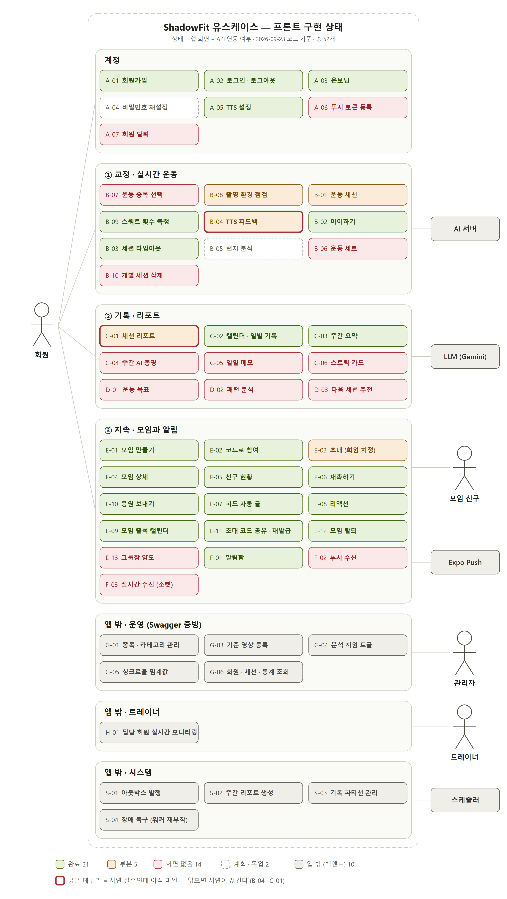
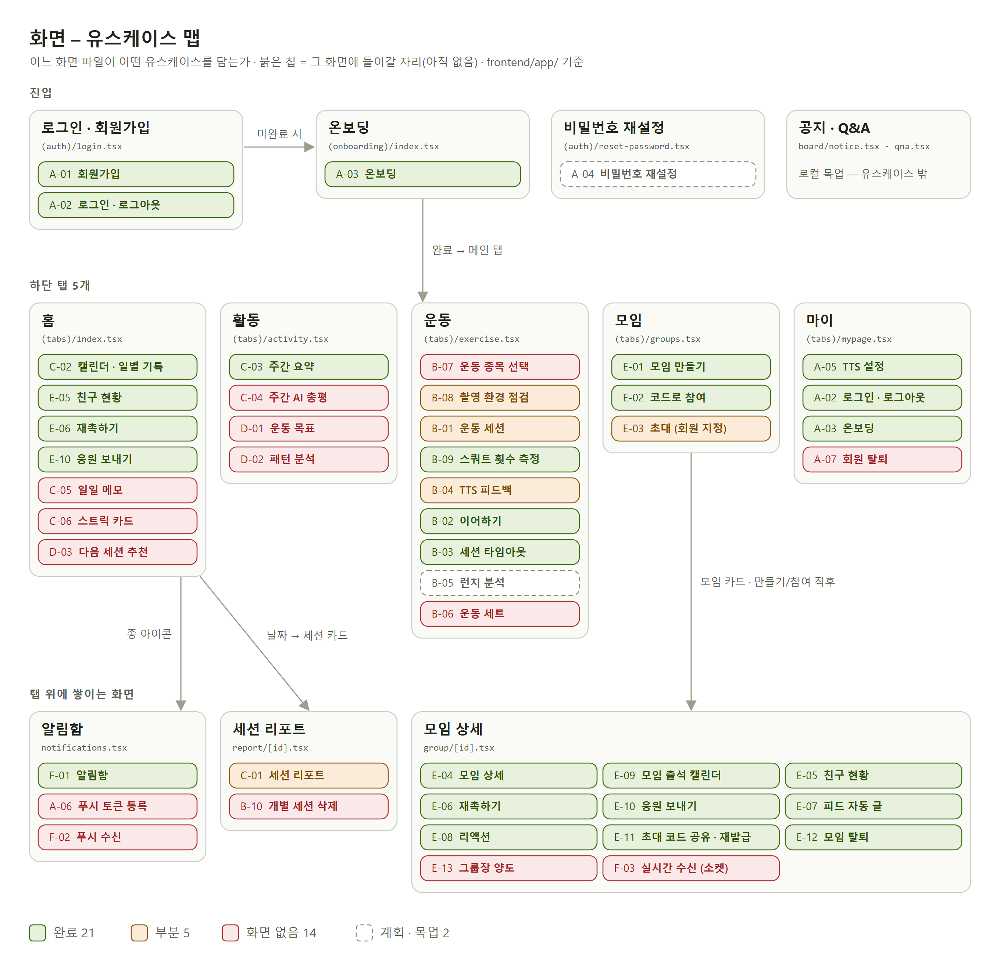
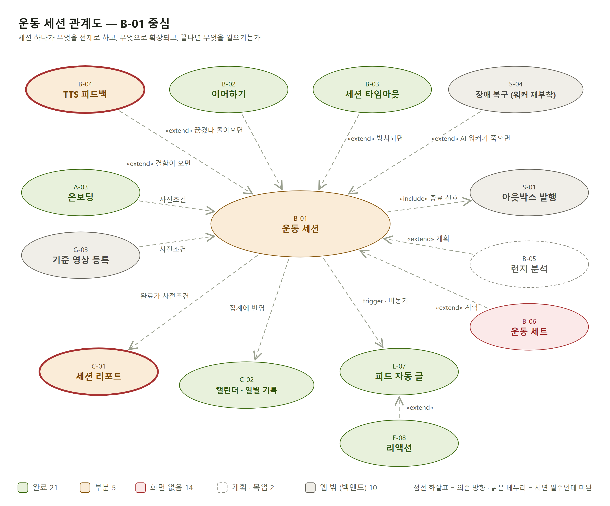
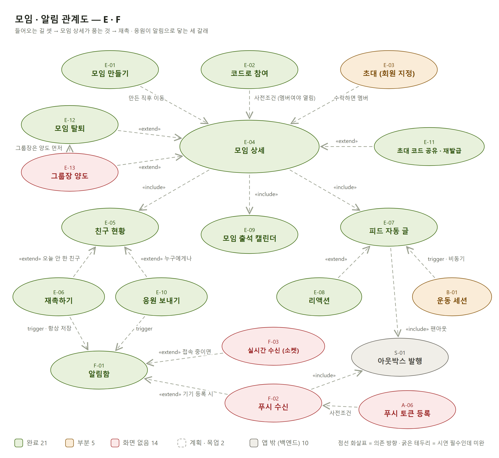
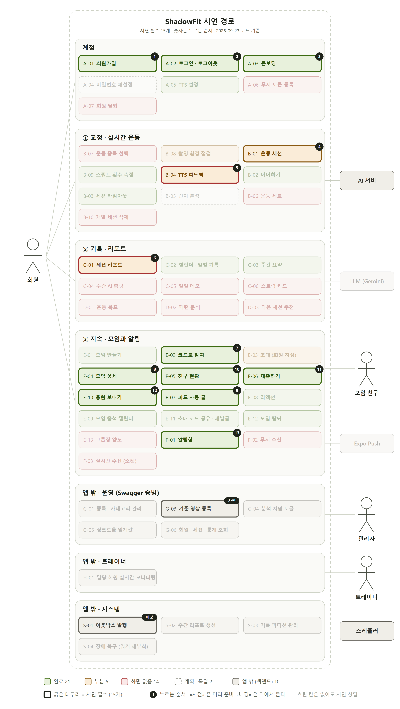
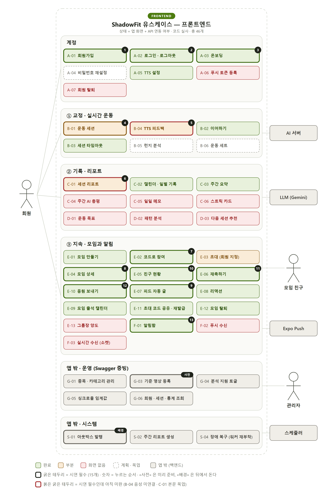
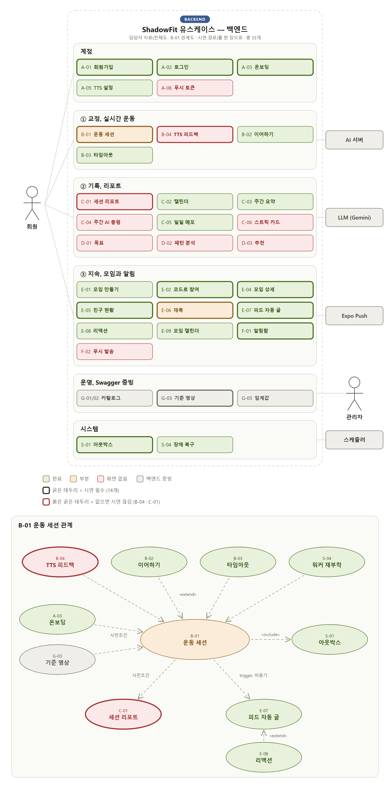
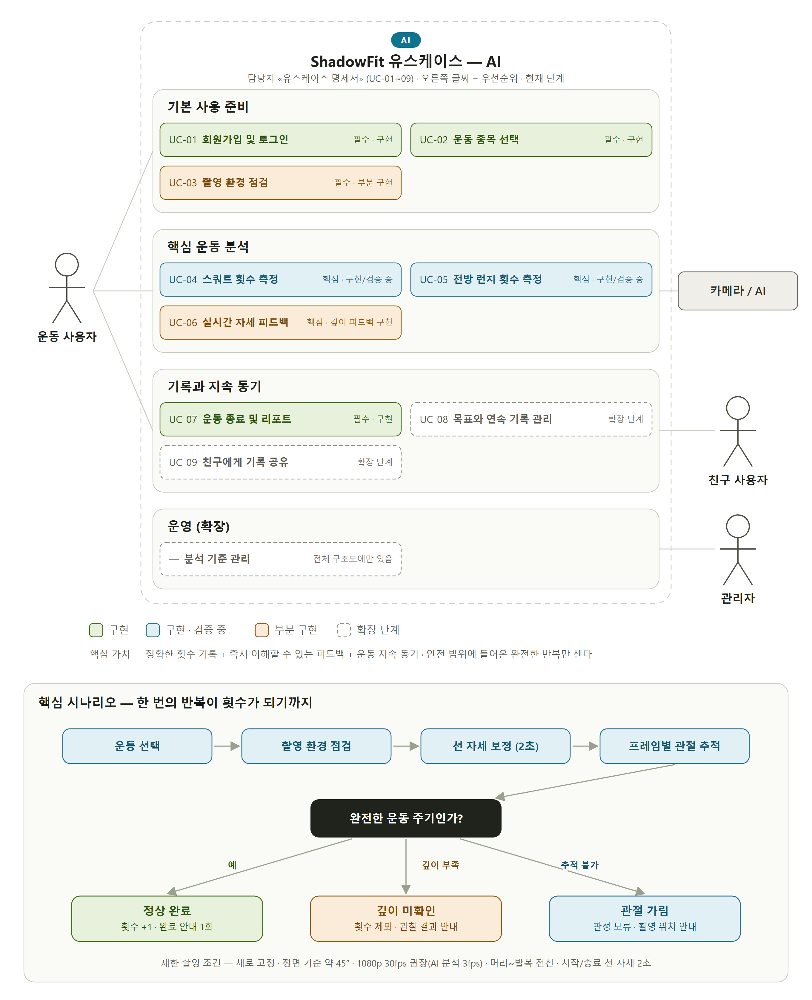
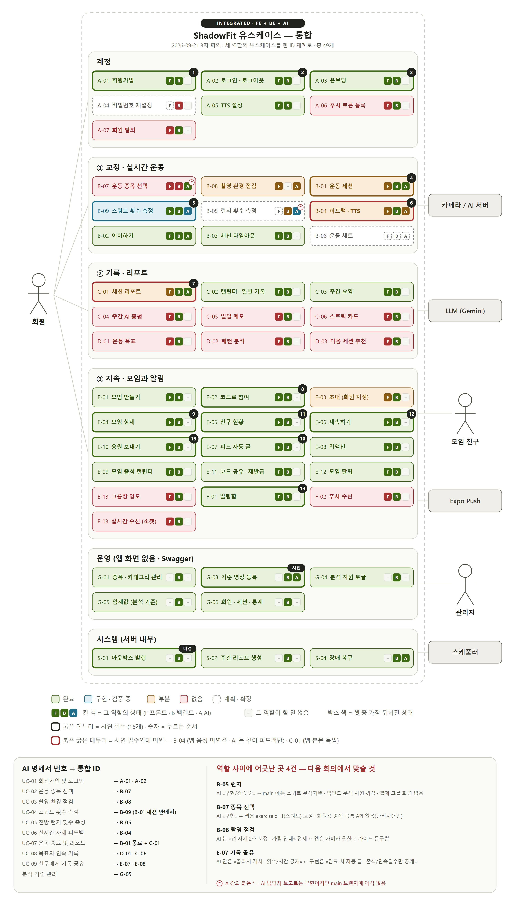

# ShadowFit 유스케이스

기준: 2026-09-23 코드 · 총 52개. 이 저장소의 **유스케이스 정본**이다 — 2026-09-23 에 백엔드 관점 문서([`../USE-CASES.md`](../USE-CASES.md))를 여기로 합쳤다.

상태는 두 축이다. **앱** 축은 «앱 화면 + API 연동» 기준이라 백엔드 API 가 있어도 화면이 없으면 «화면 없음» 으로 센다 — 그림 색과 시연 판정은 이 축이다. **백엔드** 축은 서버 API · 내부 동작이 있는지다. 두 축이 다른 행(백엔드 완료 · 앱 화면 없음)이 남은 프론트 일이다.

백엔드가 **왜** 이렇게 생겼는지(흐름 상세 · 설계 판단 W-01~W-41 · 알려진 결함)는 [`design-rationale.md`](./design-rationale.md) 에 있다. 명세의 «백엔드» 줄에 붙은 W-nn 이 그 번호다.

> 이 문서와 그림은 [`catalog.mjs`](./catalog.mjs) 에서 생성된다. 손으로 고치지 말고 카탈로그를 고친 뒤 아래 «갱신 방법» 을 돌릴 것.

## 한눈에

| 상태 | 뜻 | 개수 |
|---|---|:--:|
| 완료 | 화면이 있고 API 까지 붙어 동작 | 21 |
| 부분 | 화면은 있으나 일부가 목업 · 미연결 | 5 |
| 화면 없음 | 백엔드 API 는 있는데 앱 화면이 없음 | 14 |
| 계획 · 목업 | 백엔드 · AI 도 없거나 화면이 목업뿐 | 2 |
| 앱 밖 (백엔드) | 앱 화면 대상이 아님 (Swagger · 서버 내부) | 10 |

| 백엔드 | 뜻 | 개수 |
|---|---|:--:|
| 완료 | 서버 API · 내부 동작이 있다 | 47 |
| 부분 | 서버 쪽 일부만 있다 | 3 |
| 없음 | 서버 API 가 없다 | 1 |
| 해당 없음 | 서버가 할 일이 없다 (앱 · AI 만의 일) | 1 |

**시연을 끊는 것 2개** — 시연 필수인데 아직 미완:

- **B-04 TTS 피드백** — 🔴 시연 필수인데 미완: expo-speech 는 설치돼 있지만 Speech.speak 호출이 없다. 피드백 템플릿도 받아만 두고 쓰지 않는다. 제품 이름이 «음성 교정» 이라 소리가 안 나면 시연이 끊긴다.
- **C-01 세션 리포트** — 🔴 시연 필수인데 미완: reportService.getSessionReport 는 이미 있다 — 화면에서 MOCK_REPORT 를 그 응답(worst 구간 · repTrend · 이전 세션 대비 · 세트)으로 바꾸면 끝난다. 목업의 «파트별 점수» 는 백엔드에 없는 항목이라 빼야 한다. 운동 직후 «방금 한 결과» 를 보여주는 자리라 시연의 클라이맥스다.

## 그림

### 그림 1. 유스케이스 전체도

액터와 52개 유스케이스, 색 = 프론트 구현 상태



### 그림 2. 화면 – 유스케이스 맵

어느 화면 파일이 어떤 유스케이스를 담는가. 붉은 칩은 «여기 들어갈 자리»



### 그림 3. 운동 세션 관계도

B-01 의 사전조건 · 확장 · 종료 후 파급



### 그림 4. 모임 · 알림 관계도

모임에 들어오는 길 → 모임 상세 → 재촉 · 응원이 닿는 세 갈래



### 그림 5. 시연 경로

시연 필수 15개와 누르는 순서



## 3자 회의 자료 (2026-09-21) — 역할별 1장 + 통합 1장

[`roles.mjs`](./roles.mjs) 가 만든다. 역할별 장은 **각자 가져온 내용 그대로**(프론트 = 이 카탈로그 · 백엔드 = 담당자 그림 3장 · AI = 담당자 PDF UC-01~09), 통합본만 ID 를 하나로 맞추고 유스케이스마다 F · B · A 세 역할의 상태를 나란히 놓았다.

### 프론트엔드



### 백엔드



### AI



### 통합



이 네 장은 **09-21 회의 시점 스냅샷**이라 `build.mjs` 가 다시 만들지 않는다. 통합본에서 새로 생긴 번호(B-07 종목 선택 · B-08 촬영 점검 · B-09 스쿼트 횟수)는 09-23 에 카탈로그로 옮겼고, 그 뒤 바뀐 상태(세트 B-06 백엔드 완료 등)는 아래 목록이 정본이다.

통합본의 A 열은 AI 담당자 **보고 기준**이다 — main 브랜치에는 스쿼트 분석기뿐이라(`ai-server/app/core/analyzer_registry.py`), 보고로는 구현이지만 main 에 없는 칸은 붉은 \* 로 표시했다.

## 시연 순서

| # | 유스케이스 | 화면 | 상태 |
|:--:|---|---|---|
| 사전 | G-03 기준 영상 등록 | (앱 화면 없음 — Swagger) | 앱 밖 (백엔드) |
| 1 | A-01 회원가입 | app/(auth)/login.tsx — «회원가입» 탭 | 완료 |
| 2 | A-02 로그인 · 로그아웃 | app/(auth)/login.tsx · app/(tabs)/mypage.tsx(로그아웃) · stores/authStore.ts · services/api.ts | 완료 |
| 3 | A-03 온보딩 | app/(onboarding)/index.tsx (마이 탭에서 수정 진입 가능) | 완료 |
| 4 | B-01 운동 세션 | app/(tabs)/exercise.tsx | 부분 |
| 5 | B-04 TTS 피드백 🔴 | app/(tabs)/exercise.tsx — 자세 결함 토스트 · 햅틱 | 부분 |
| 6 | C-01 세션 리포트 🔴 | app/report/[id].tsx | 부분 |
| 7 | E-02 코드로 참여 | app/(tabs)/groups.tsx — «초대 코드로 참여» 시트 | 완료 |
| 8 | E-04 모임 상세 | app/group/[id].tsx | 완료 |
| 9 | E-07 피드 자동 글 | app/group/[id].tsx — «모임 피드» | 완료 |
| 10 | E-05 친구 현황 | app/(tabs)/index.tsx «최신 모임 운동 현황» · app/group/[id].tsx «구성원 운동 현황» — components/social/FriendStatusList.tsx 공용 | 완료 |
| 11 | E-06 재촉하기 | FriendStatusList — «재촉» 버튼 | 완료 |
| 12 | E-10 응원 보내기 | components/social/CheerModal.tsx — FriendStatusList 의 «응원» 버튼 | 완료 |
| 13 | F-01 알림함 | app/notifications.tsx — 홈 오른쪽 위 종 아이콘 | 완료 |
| 배경 | S-01 아웃박스 발행 | (서버 내부) | 앱 밖 (백엔드) |

## 목록

| ID | 이름 | 액터 | 앱 | 백엔드 | 시연 |
|---|---|---|---|---|:--:|
| A-01 | 회원가입 | 회원 | 완료 | 완료 | 1 |
| A-02 | 로그인 · 로그아웃 | 회원 | 완료 | 완료 | 2 |
| A-03 | 온보딩 | 회원 | 완료 | 완료 | 3 |
| A-04 | 비밀번호 재설정 | 회원 | 계획 · 목업 | 없음 |  |
| A-05 | TTS 설정 | 회원 | 완료 | 완료 |  |
| A-06 | 푸시 토큰 등록 | 회원, Expo Push | 화면 없음 | 완료 |  |
| A-07 | 회원 탈퇴 | 회원 | 화면 없음 | 완료 |  |
| B-07 | 운동 종목 선택 | 회원 | 화면 없음 | 완료 |  |
| B-08 | 촬영 환경 점검 | 회원, AI 서버 | 부분 | 해당 없음 |  |
| B-01 | 운동 세션 | 회원, AI 서버 | 부분 | 완료 | 4 |
| B-09 | 스쿼트 횟수 측정 | 회원, AI 서버 | 완료 | 완료 |  |
| B-04 | TTS 피드백 🔴 | 회원, AI 서버 | 부분 | 완료 | 5 |
| B-02 | 이어하기 | 회원, AI 서버 | 완료 | 완료 |  |
| B-03 | 세션 타임아웃 | 스케줄러, 회원 | 완료 | 완료 |  |
| B-05 | 런지 분석 | 회원, AI 서버 | 계획 · 목업 | 부분 |  |
| B-06 | 운동 세트 | 회원, AI 서버 | 화면 없음 | 완료 |  |
| B-10 | 개별 세션 삭제 | 회원 | 화면 없음 | 완료 |  |
| C-01 | 세션 리포트 🔴 | 회원 | 부분 | 완료 | 6 |
| C-02 | 캘린더 · 일별 기록 | 회원 | 완료 | 완료 |  |
| C-03 | 주간 요약 | 회원 | 완료 | 완료 |  |
| C-04 | 주간 AI 총평 | 회원, LLM (Gemini) | 화면 없음 | 완료 |  |
| C-05 | 일일 메모 | 회원 | 화면 없음 | 완료 |  |
| C-06 | 스트릭 카드 | 회원 | 화면 없음 | 완료 |  |
| D-01 | 운동 목표 | 회원 | 화면 없음 | 완료 |  |
| D-02 | 패턴 분석 | 회원 | 화면 없음 | 완료 |  |
| D-03 | 다음 세션 추천 | 회원 | 화면 없음 | 완료 |  |
| E-01 | 모임 만들기 | 회원 | 완료 | 완료 |  |
| E-02 | 코드로 참여 | 회원 | 완료 | 완료 | 7 |
| E-03 | 초대 (회원 지정) | 회원, 모임 친구 | 부분 | 완료 |  |
| E-04 | 모임 상세 | 회원 | 완료 | 완료 | 8 |
| E-05 | 친구 현황 | 회원 | 완료 | 완료 | 10 |
| E-06 | 재촉하기 | 회원, 모임 친구 | 완료 | 완료 | 11 |
| E-10 | 응원 보내기 | 회원, 모임 친구 | 완료 | 완료 | 12 |
| E-07 | 피드 자동 글 | 회원, 모임 친구 | 완료 | 완료 | 9 |
| E-08 | 리액션 | 회원 | 완료 | 완료 |  |
| E-09 | 모임 출석 캘린더 | 회원 | 완료 | 완료 |  |
| E-11 | 초대 코드 공유 · 재발급 | 회원 | 완료 | 완료 |  |
| E-12 | 모임 탈퇴 | 회원 | 완료 | 완료 |  |
| E-13 | 그룹장 양도 | 회원 | 화면 없음 | 완료 |  |
| F-01 | 알림함 | 회원 | 완료 | 완료 | 13 |
| F-02 | 푸시 수신 | 모임 친구, Expo Push | 화면 없음 | 완료 |  |
| F-03 | 실시간 수신 (소켓) | 회원 | 화면 없음 | 완료 |  |
| G-01 | 종목 · 카테고리 관리 | 관리자 | 앱 밖 (백엔드) | 완료 |  |
| G-03 | 기준 영상 등록 | 관리자, AI 서버 | 앱 밖 (백엔드) | 부분 | 사전 |
| G-04 | 분석 지원 토글 | 관리자 | 앱 밖 (백엔드) | 완료 |  |
| G-05 | 싱크로율 임계값 | 관리자 | 앱 밖 (백엔드) | 부분 |  |
| G-06 | 회원 · 세션 · 통계 조회 | 관리자 | 앱 밖 (백엔드) | 완료 |  |
| H-01 | 담당 회원 실시간 모니터링 | 트레이너 | 앱 밖 (백엔드) | 완료 |  |
| S-01 | 아웃박스 발행 | 스케줄러, AI 서버, Expo Push | 앱 밖 (백엔드) | 완료 | 배경 |
| S-02 | 주간 리포트 생성 | 스케줄러, LLM (Gemini) | 앱 밖 (백엔드) | 완료 |  |
| S-03 | 기록 파티션 관리 | 스케줄러 | 앱 밖 (백엔드) | 완료 |  |
| S-04 | 장애 복구 (워커 재부착) | 스케줄러, AI 서버 | 앱 밖 (백엔드) | 완료 |  |

## 액터

| 액터 | 유형 | 설명 |
|---|---|---|
| 회원 | 사람 | 앱으로 운동하고 모임에 참여하는 일반 사용자. 거의 모든 유스케이스의 주 액터. |
| 모임 친구 | 사람 | 같은 모임의 다른 회원. 재촉·응원의 수신자이자 피드·리액션의 상대. 역할만 다를 뿐 «회원» 과 같은 앱을 쓴다. |
| 관리자 | 사람 | ROLE_ADMIN. 종목·기준 영상·임계값을 관리한다. 앱 화면은 없고 Swagger 로 시연한다. |
| 트레이너 | 사람 | ROLE_TRAINER. 담당 회원의 운동을 실시간으로 지켜본다(H-01). 앱 화면은 없다. |
| AI 서버 | 시스템 | FastAPI + MediaPipe. 앱이 카메라 프레임을 HTTP 로 직접 보내면(POST /pose) 싱크로율·rep·자세 결함을 돌려준다. Spring 과는 gRPC. |
| LLM (Gemini) | 시스템 | 주간 AI 총평 문장을 만든다. 실패하면 서버가 템플릿 문장으로 대체한다. |
| Expo Push | 시스템 | 서버가 보낸 재촉·응원을 FCM/APNs 로 중계한다. 앱이 토큰을 등록해야 도달한다(지금은 미등록). |
| 스케줄러 | 시스템 | Spring 내부 @Scheduled 6곳. 방치 세션 타임아웃(1분), 아웃박스 발행(1초), 주간 리포트 생성(5초), pose_data 파티션 관리(매일 04:00), 고아 pose 감시(04:30), 트레이너 스트림 하트비트(30초). |

## 유스케이스 명세

### 계정

#### A-01 회원가입 — 완료 · 시연 1번

- **액터**: 회원
- **화면**: app/(auth)/login.tsx — «회원가입» 탭
- **API**: `POST /member/signup` · `POST /member/login (가입 직후 자동 호출)`
- **사전조건**: 없음
- **기본 흐름**
  1. 회원이 로그인 화면에서 «회원가입» 탭으로 전환한다.
  2. 닉네임·이메일·비밀번호·성별을 입력하고 가입을 누른다.
  3. 앱이 POST /member/signup 을 호출한다. 서버는 토큰을 주지 않는다.
  4. 앱이 같은 이메일·비밀번호로 곧바로 로그인(A-02)을 호출한다.
  5. 신규 회원은 온보딩 값이 비어 있어 라우팅 가드가 온보딩(A-03)으로 보낸다.
- **대안 · 예외**
  - 이메일·닉네임 중복 → 서버 message 를 알림창으로 그대로 보여준다.
  - 필수값 누락 → 요청 전에 입력칸 아래 오류 문구.
- **사후조건**: 회원 생성 + 로그인 상태, 온보딩 화면에 서 있다.
- **프론트 메모**: 에러 응답은 {status, message, timestamp} — code 필드가 없어 분기는 HTTP status 로 한다.
- **백엔드**: 완료 — 가입은 토큰을 주지 않는다 — 앱이 곧바로 로그인을 부른다.

#### A-02 로그인 · 로그아웃 — 완료 · 시연 2번

- **액터**: 회원
- **화면**: app/(auth)/login.tsx · app/(tabs)/mypage.tsx(로그아웃) · stores/authStore.ts · services/api.ts
- **API**: `POST /member/login` · `POST /member/reissue` · `POST /member/logout`
- **사전조건**: 가입된 계정
- **기본 흐름**
  1. 회원이 이메일·비밀번호로 로그인한다.
  2. 앱이 accessToken·refreshToken 을 보안 저장소에 넣는다(폰은 expo-secure-store, 웹은 localStorage).
  3. 온보딩 조회 응답에서 내 memberId·username 을 같이 기억한다(getMe API 가 없어서).
  4. 이후 모든 요청에 Authorization 헤더가 자동으로 붙는다.
  5. 앱을 다시 켜면 저장된 토큰으로 세션을 복원한다.
  6. 마이 탭에서 로그아웃 → 확인창 → POST /member/logout → 로컬 토큰 삭제 → 로그인 화면.
- **대안 · 예외**
  - 비밀번호 불일치 → 401, 알림창(이때는 재발급을 시도하지 않는다).
  - access 만료로 401 → /member/reissue 로 **한 번만** 재발급(토큰 회전) 후 원래 요청 재시도.
  - 재발급도 실패 → 강제 로그아웃 후 로그인 화면으로.
  - 로그아웃 서버 호출이 실패해도 로컬 세션은 지운다.
- **사후조건**: 유효한 토큰 쌍 보유 / 로그아웃 시 토큰 무효 + 서버가 그 계정의 푸시 토큰도 지운다.
- **프론트 메모**: 웹에서는 Alert.alert 가 빈 함수라 utils/alert.ts 래퍼로 window.confirm 을 쓴다.
- **백엔드**: 완료 — access 30분 + refresh(회전). 로그아웃은 refresh · 푸시 토큰 행 삭제뿐이라 로그아웃한 access 는 최대 30분 남는다 — 블랙리스트는 08-10 에 없앴다(W-37).

#### A-03 온보딩 — 완료 · 시연 3번

- **액터**: 회원
- **화면**: app/(onboarding)/index.tsx (마이 탭에서 수정 진입 가능)
- **API**: `GET /member/onboarding/{email}` · `PATCH /member/onboarding/{email}`
- **사전조건**: 로그인 완료
- **기본 흐름**
  1. 운동 수준(입문~전문가 5단계)을 고른다.
  2. 키·몸무게를 입력한다.
  3. 코치 페르소나(헬린이 · FM 교관 · 다이어터 · 재활 전문)를 고른다.
  4. 따라 할 운동 영상(YouTube URL)을 입력한다.
  5. PATCH 로 저장하면 onboardingCompleted 가 true 가 되어 메인 탭으로 이동한다.
- **대안 · 예외**
  - 온보딩 미완료 상태로 다른 화면 진입 → 가드가 온보딩으로 되돌린다.
- **사후조건**: 수준·키·몸무게·선호 영상이 채워져 운동 세션(B-01)을 시작할 수 있다.
- **백엔드**: 완료 — 선호 영상 URL 은 형식 검증 없이 저장된다 — YoutubeValidator 는 호출처가 없다(#802).

#### A-04 비밀번호 재설정 — 계획 · 목업

- **액터**: 회원
- **화면**: app/(auth)/reset-password.tsx — **목업**
- **API**: `(백엔드 API 없음)`
- **사전조건**: 가입된 이메일
- **기본 흐름**
  1. 이메일 입력 → 인증 코드 발송
  2. 인증 코드 확인
  3. 새 비밀번호 저장
- **사후조건**: 새 비밀번호로 로그인 가능
- **프론트 메모**: 세 단계 화면은 있지만 전부 setTimeout 가짜 응답이다. 시연 경로에서 누르지 않는다.
- **백엔드**: 없음 — 재설정 API 가 없다(메일 발송 인프라 없음).

#### A-05 TTS 설정 — 완료

- **액터**: 회원
- **화면**: app/(tabs)/mypage.tsx — 토글 + 속도 슬라이더
- **API**: `GET /preferences/tts` · `PATCH /preferences/tts`
- **사전조건**: 로그인
- **기본 흐름**
  1. 마이 탭에 들어오면 현재 설정(ttsEnabled, ttsSpeed)을 조회한다.
  2. 토글을 누르면 화면을 먼저 바꾸고 서버에 반영한다.
  3. 속도 슬라이더는 손을 뗄 때(0.1 단위 반올림)만 서버에 반영한다.
- **대안 · 예외**
  - 서버 반영 실패 → 이전 값으로 되돌리고 알림창.
  - 미설정 회원 → 기본값(켜짐, 1.0배).
- **사후조건**: 설정 저장. 단, 운동 화면이 아직 음성을 내지 않아(B-04) 체감 효과는 없다.
- **백엔드**: 완료

#### A-06 푸시 토큰 등록 — 화면 없음

- **액터**: 회원, Expo Push
- **화면**: (없음 — 화면이 아니라 로그인 직후 1회 도는 훅이 필요)
- **API**: `POST /push-tokens {token, platform}`
- **사전조건**: 로그인, 알림 권한 허용
- **기본 흐름**
  1. 로그인 직후 알림 권한을 요청한다.
  2. ExponentPushToken 을 받아 POST /push-tokens 로 등록한다(멱등 200).
- **대안 · 예외**
  - 권한 거부 → 등록하지 않는다. 재촉·응원은 알림함(F-01)으로만 확인한다.
- **사후조건**: 이 기기로 재촉·응원 푸시(F-02)가 도달한다.
- **프론트 메모**: expo-notifications 미설치. Expo Go(SDK 53+)는 원격 푸시를 지원하지 않아 dev build 가 필요하다.
- **백엔드**: 완료 — 멱등 200. 로그아웃 · 탈퇴 때 서버가 지운다.

#### A-07 회원 탈퇴 — 화면 없음

- **액터**: 회원
- **화면**: (없음 — services/authService.ts 에 함수만 있다)
- **API**: `DELETE /member/{email}`
- **사전조건**: 로그인
- **기본 흐름**
  1. 마이 탭에서 탈퇴를 누르고 확인한다.
  2. 서버가 회원과 연관 데이터를 삭제한다.
  3. 로컬 세션을 정리하고 로그인 화면으로 이동한다.
- **대안 · 예외**
  - 그룹장인 모임이 있으면 그 모임의 처리 규칙(E-12·E-13)이 먼저 걸린다.
- **사후조건**: 계정 삭제. 남이 받은 알림의 보낸 사람은 «탈퇴한 회원» 으로 보인다.
- **백엔드**: 완료 — 회원과 연관 데이터 전체 삭제.

### ① 교정 · 실시간 운동

#### B-07 운동 종목 선택 — 화면 없음

- **액터**: 회원
- **화면**: (없음 — 운동 탭 시작 전 자리)
- **API**: `GET /exercises (2026-09-22)`
- **사전조건**: 로그인
- **기본 흐름**
  1. 운동 탭에서 종목 목록을 본다.
  2. 분석 지원(analysisSupported) 종목만 고를 수 있다 — 아닌 종목은 «준비 중».
  3. 고른 exerciseId 로 B-01 을 시작한다.
- **대안 · 예외**
  - 분석 미지원 종목으로 세션 시작 → 400 W007.
- **사후조건**: 선택한 종목으로 B-01 진입
- **프론트 메모**: 3자 회의(09-21) 통합본에서 AI 명세 UC-02 를 옮긴 번호. 회원용 목록 API 는 09-22 에 생겼고(#785), 앱은 아직 exerciseId=1 고정이다.
- **백엔드**: 완료 — #785 (09-22). analysisSupported=false 종목도 내려준다 — 그걸로 시작하면 W007.

#### B-08 촬영 환경 점검 — 부분

- **액터**: 회원, AI 서버
- **화면**: app/(tabs)/exercise.tsx — 카메라 권한 · 가이드 문구
- **API**: `(AI: 선 자세 보정 · 가림 판정)`
- **사전조건**: 카메라 권한
- **기본 흐름**
  1. 전신이 화면에 들어오도록 선다.
  2. 선 자세 2초로 기준 자세를 잡는다.
  3. 관절이 가려지면 촬영 위치를 다시 잡으라고 안내한다.
- **대안 · 예외**
  - 관절 가림 → 판정 보류.
- **사후조건**: 프레임이 판정에 쓸 수 있는 상태
- **프론트 메모**: AI 명세 UC-03. 앱은 권한 요청과 가이드 문구까지만 있다. 백엔드가 할 일은 없다.
- **백엔드**: 해당 없음

#### B-01 운동 세션 — 부분 · 시연 4번

- **액터**: 회원, AI 서버
- **화면**: app/(tabs)/exercise.tsx
- **API**: `POST /exercises/sessions` · `AI: POST /pose (Bearer AI_PUBLIC_TOKEN, X-AI-Worker)` · `PATCH /sessions/{id}/end`
- **사전조건**: 로그인 · 온보딩 완료(A-03) · 그 종목의 기준 영상 좌표 등록(G-03) · 카메라 권한
- **기본 흐름**
  1. 운동 탭에 들어오면 카메라 권한을 확인한다(없으면 권한 요청 화면).
  2. «시작» → POST /exercises/sessions → sessionId 와 담당 AI 워커 번호를 받는다.
  3. 앱이 카메라 프레임을 일정 주기로 AI 서버에 직접 보낸다. 같은 워커로 가도록 X-AI-Worker 헤더를 싣는다.
  4. 응답의 싱크로율을 막대·숫자로, rep 수를 카운터로 갱신한다(80% 이상 라임 / 60~80 주황 / 60 미만 빨강).
  5. 자세 결함이 오면 B-04 로 알린다.
  6. «종료» → PATCH /sessions/{id}/end. 앱은 결과값을 보내지 않고 종료 신호만 보낸다.
  7. 서버가 아웃박스(S-01)로 AI 에 중지를 알리고 집계한 뒤 세션을 COMPLETED 로 만든다.
- **대안 · 예외**
  - 앱이 백그라운드로 가면 프레임 전송만 멈춘다 — 세션은 끝내지 않고 돌아오면 이어간다(B-02).
  - 종료를 못 누르고 앱이 죽으면 → 다시 켰을 때 B-02, 너무 오래 지났으면 B-03.
  - EXPO_PUBLIC_AI_PUBLIC_TOKEN 이 없으면 **에러 없이** 프레임 전송이 꺼진다(싱크로율이 0 에서 안 움직임).
- **사후조건**: 세션 COMPLETED → 캘린더·주간 요약에 반영, 내 모임 피드에 완료 글(E-07), 리포트(C-01) 조회 가능.
- **프론트 메모**: «부분» 인 이유: exerciseId 가 1(스쿼트)로 고정이고 종목 선택 화면이 없다. 발표 범위(스쿼트 하나)에서는 그대로 시연된다.
- **백엔드**: 완료 — 시작은 AI 를 기다리지 않고 202 — StartAnalysis 는 커밋 뒤 @Async(W-01). 시작 때 워커 서킷이 OPEN 이면 세션을 바로 FAILED. 종료는 endTime 과 같은 트랜잭션에 아웃박스 STOP_ANALYSIS(W-07), AI 의 CompleteAnalysis 콜백에서 COMPLETED · 리포트 precompute · SESSION_COMPLETED 적재. 겹치면 **AI 완료가 이긴다**(W-10). 결함: StartAnalysis 의 success=false 를 안 읽음(#798), CompleteAnalysis 는 아웃박스가 아니라 AI 3회 재시도뿐(#799).

#### B-09 스쿼트 횟수 측정 — 완료

- **액터**: 회원, AI 서버
- **화면**: app/(tabs)/exercise.tsx — rep 카운터
- **API**: `AI: POST /pose 응답의 rep` · `gRPC SavePoseDataBatch (AI → Spring)`
- **사전조건**: 세션 진행 중(B-01)
- **기본 흐름**
  1. AI 가 프레임마다 관절 각도를 추적한다.
  2. 완전한 반복 한 번이 끝나면 rep 을 1 올리고 싱크로율을 계산한다.
  3. 앱 카운터가 갱신되고, rep 기록은 Spring 의 pose_data 에 쌓인다.
- **대안 · 예외**
  - 깊이 미달 → 횟수에서 뺀다.
  - 관절 가림 → 판정 보류(B-08).
- **사후조건**: pose_data 에 rep 별 기록 — 리포트(C-01) · 세트 집계(B-06)의 입력
- **프론트 메모**: AI 명세 UC-04. 반복 판정은 시간 기반 SquatCounter FSM(#784).
- **백엔드**: 완료 — rep 마다 AI → gRPC SavePoseDataBatch → pose_data(월별 파티션, W-05). rep 수는 AI 값, 싱크 통계 · 세트는 Spring 이 저장본에서 집계한다(W-08, #75).

#### B-04 TTS 피드백 — 부분 · 시연 5번

- **액터**: 회원, AI 서버
- **화면**: app/(tabs)/exercise.tsx — 자세 결함 토스트 · 햅틱
- **API**: `AI: POST /pose 응답의 feedback_type` · `GET /exercises/{id}/feedback-templates` · `GET /sessions/{id}/feedback-summary (리포트용)` · `GET /sessions/{id}/feedbacks (발화 로그 원본 — 화면 없음)`
- **사전조건**: 세션 진행 중(B-01), TTS 켜짐(A-05)
- **기본 흐름**
  1. AI 응답에 feedback_type(예: 무릎 모임 · 상체 숙임)이 실려 온다.
  2. 화면 상단에 결함 문구 토스트가 4초간 뜬다.
  3. 싱크로율이 60% 아래로 떨어지는 순간 경고 햅틱이 울린다.
  4. 〔미구현〕 페르소나에 맞는 문장을 회원이 정한 속도로 **음성 발화**한다.
- **대안 · 예외**
  - TTS 를 꺼 둔 회원(A-05)은 토스트·햅틱만 받는다.
- **사후조건**: 서버에는 발화 이벤트가 세트 경계마다 묶여 저장되고(gRPC), 리포트의 «자세 교정 알림» 집계로 보인다.
- **프론트 메모**: 🔴 시연 필수인데 미완: expo-speech 는 설치돼 있지만 Speech.speak 호출이 없다. 피드백 템플릿도 받아만 두고 쓰지 않는다. 제품 이름이 «음성 교정» 이라 소리가 안 나면 시연이 끊긴다.
- **백엔드**: 완료 — 발화 로그는 세트 경계마다 묶어 gRPC 로 저장. 템플릿 API 는 페르소나별 문장을 준다.

#### B-02 이어하기 — 완료

- **액터**: 회원, AI 서버
- **화면**: app/(tabs)/exercise.tsx — tryResume (화면 포커스 · 포그라운드 복귀 때)
- **API**: `GET /sessions/active` · `POST /sessions/{id}/reattach`
- **사전조건**: 끝내지 않은 세션이 서버에 남아 있다
- **기본 흐름**
  1. 운동 탭에 들어오거나 앱이 포그라운드로 돌아오면 GET /sessions/active 를 부른다.
  2. 진행 중 세션이 있으면 POST /sessions/{id}/reattach 를 부른다.
  3. 서버가 DB 의 pose_data(마지막 rep · 경과 시간)로 AI 상태를 다시 세운다.
  4. «운동을 이어합니다» 안내 후 같은 세션으로 프레임 전송을 재개한다.
- **대안 · 예외**
  - 204(이어할 세션 없음) → 조용히 넘어간다.
  - 이미 종료 요청된 세션 → 이어하기를 권하지 않는다.
  - 조회 실패 → 조용히 포기, 새로 시작할 수 있다.
- **사후조건**: 같은 sessionId 로 계속 기록된다.
- **백엔드**: 완료 — reattach 는 AI 에 상태가 있으면 보존 — 멱등 규칙이 Start 와 반대라 RPC 를 따로 뒀다(W-12). 진행 중이던 rep 은 복원되지 않는다.

#### B-03 세션 타임아웃 — 완료

- **액터**: 스케줄러, 회원
- **화면**: app/(tabs)/exercise.tsx — «이어하기 시간 초과» 안내
- **API**: `(서버 내부) SessionTimeoutScheduler — 1분 주기`
- **사전조건**: 마지막 rep 뒤 10분이 지난 IN_PROGRESS 세션 (rep 이 하나도 없으면 시작 + 예상 시간 + 30분)
- **기본 흐름**
  1. 스케줄러가 방치된 세션을 FAILED 로 바꾼다.
  2. 회원이 돌아와 이어하기를 시도하면 앱이 «너무 오래 지나 이어할 수 없습니다. 새로 시작해주세요» 를 보여준다.
- **대안 · 예외**
  - 타임아웃과 AI 의 정상 완료가 겹치면 **AI 완료**가 이긴다 — 늦게 온 완료도 FAILED 를 COMPLETED 로 덮는다.
- **사후조건**: 영원히 «진행 중» 인 세션이 남지 않는다.
- **백엔드**: 완료 — 기준은 rep 이 있으면 lastActiveAt + 10분, 없으면 시작 + 예상 시간 + 30분(W-11). FAILED 는 출석으로 안 세지만 종착 상태는 아니다.

#### B-05 런지 분석 — 계획 · 목업

- **액터**: 회원, AI 서버
- **화면**: (운동 탭 — 종목 선택 화면 필요)
- **API**: `(AI 런지 분석기 없음)` · `종목 코드 exercises.code = LUNGE (V25)` · `켜는 스위치: PATCH /admin/exercises/{id}/analysis-support`
- **사전조건**: AI 에 런지 분석기, 런지 기준 영상(G-03)
- **기본 흐름**
  1. 종목 선택(B-07)에서 런지를 고른다.
  2. 이후는 B-01 과 같다.
- **사후조건**: —
- **프론트 메모**: DB 에 종목 행은 있으나 analysis_supported=FALSE. 백엔드는 종목 코드(#785)·AI 로 종목 코드를 싣는 proto(#787)까지 왔고, 남은 건 AI 분석기다(decisions/lunge-and-set-backend.md §2-4).
- **백엔드**: 부분 — 종목 코드(V25, #785) · proto 로 종목 코드 전달(#787)까지. 분석 지원 스위치는 꺼져 있다.

#### B-06 운동 세트 — 화면 없음

- **액터**: 회원, AI 서버
- **화면**: (운동 탭 — 루틴 시작 · 중단 확인 · 운동 기록 모달)
- **API**: `POST /exercises/sessions {targetRepsPerSet?, targetSets?} (V26)` · `GET /reports/session/{id} 의 sets[]`
- **사전조건**: 세션 시작 때 세트당 횟수 · 세트 수를 정한다(생략하면 추천 공식)
- **기본 흐름**
  1. 루틴(종목 × 횟수 × 세트)을 확인하고 시작한다.
  2. 세트 경계마다 쉬는 시간과 진행도를 보여준다.
  3. 끝나면 오늘 운동 기록 요약을 보여준다.
- **대안 · 예외**
  - «중단할게요» → 진행한 데까지만 기록한다.
- **사후조건**: 세션 완료 때 서버가 pose_data 의 rep 별 집계로 세트 표를 만든다 — «3세트 x 12회 (마지막 7회)».
- **프론트 메모**: 백엔드는 09-22 에 들어왔다(#786) — 세트 경계는 «rep 이 세트당 목표에 닿는 순간» 이라 AI 세트 인지 없이 저장본에서 역산한다. 앱에 세트 입력 · 표시가 없다.
- **백엔드**: 완료 — #786 (09-22). 세트 번호 = ceil(rep_number / 세트당 목표). pose_data 에 set_index 를 더하지 않고 완료 시점에 한 쿼리로 집계, 첫 완료 전이에서만 INSERT(재전송 중복 없음). 도중 변경 API 는 두지 않는다(W-14). AI 의 세트 cue 는 미구현.

#### B-10 개별 세션 삭제 — 화면 없음

- **액터**: 회원
- **화면**: (없음 — 리포트 화면이 자리)
- **API**: `DELETE /sessions/{id}`
- **사전조건**: 내 세션
- **기본 흐름**
  1. 리포트에서 삭제를 누르고 확인한다.
  2. 서버가 세션과 딸린 기록(pose_data · 세트 행)을 지운다 → 204.
- **대안 · 예외**
  - 남의 세션 · 없는 세션 → 둘 다 404(존재를 드러내지 않는다).
  - 진행 중 세션 → 409, 먼저 종료해야 한다.
- **사후조건**: 캘린더 · 주간 요약 · 출석에서 빠진다.
- **백엔드**: 완료

### ② 기록 · 리포트

#### C-01 세션 리포트 — 부분 · 시연 6번

- **액터**: 회원
- **화면**: app/report/[id].tsx
- **API**: `GET /sessions/{id}/feedback-summary (연결됨)` · `GET /reports/session/{id} (서비스 함수만 있고 화면이 안 쓴다)`
- **사전조건**: 완료된 세션
- **기본 흐름**
  1. 홈에서 날짜를 누르고 그날의 세션 카드를 누른다.
  2. 리포트 화면이 열린다.
  3. «자세 교정 알림 · 총 N회» 와 결함 종류별 횟수가 **실데이터**로 보인다.
  4. 〔목업〕 평균 싱크로율 · 종목별 점수 · 최악 구간은 아직 하드코딩된 MOCK_REPORT 다.
- **대안 · 예외**
  - 피드백 0건 → 그 카드는 숨긴다.
- **사후조건**: 읽기 전용
- **프론트 메모**: 🔴 시연 필수인데 미완: reportService.getSessionReport 는 이미 있다 — 화면에서 MOCK_REPORT 를 그 응답(worst 구간 · repTrend · 이전 세션 대비 · 세트)으로 바꾸면 끝난다. 목업의 «파트별 점수» 는 백엔드에 없는 항목이라 빼야 한다. 운동 직후 «방금 한 결과» 를 보여주는 자리라 시연의 클라이맥스다.
- **백엔드**: 완료 — 싱크 통계 · rep 별 추이 · worst 구간 · 이전 세션 대비를 COMPLETED 전이 때 1회 계산해 저장(W-28). 09-22 부터 sets[]. FAILED 세션은 리포트 행이 없고, «파트별 점수» 는 구현이 없다.

#### C-02 캘린더 · 일별 기록 — 완료

- **액터**: 회원
- **화면**: app/(tabs)/index.tsx (홈)
- **API**: `GET /reports/calendar?year&month` · `GET /reports/daily?date`
- **사전조건**: 로그인
- **기본 흐름**
  1. 홈 상단 카드 3개: 이번 달 운동 일수 · 평균 싱크로율 · 연속 기록.
  2. 캘린더에 운동한 날이 점으로 찍힌다(점 색 = 그날 평균 싱크로율 80/60 기준).
  3. 날짜를 누르면 그날의 세션 목록(종목 · 세트 요약 · 싱크로율)이 아래에 뜬다.
  4. 세션 카드를 누르면 리포트(C-01)로 간다.
  5. 달을 넘기면 그 달을 다시 조회한다.
- **대안 · 예외**
  - 기록 없는 날 → «운동 기록이 없습니다».
- **사후조건**: 읽기 전용. 화면에 돌아올 때마다 재조회한다.
- **백엔드**: 완료

#### C-03 주간 요약 — 완료

- **액터**: 회원
- **화면**: app/(tabs)/activity.tsx (활동)
- **API**: `GET /reports/weekly-summary`
- **사전조건**: 로그인
- **기본 흐름**
  1. 이번 주 운동 횟수 · 분 · 칼로리를 본다.
  2. 요일별 운동 시간 막대(오늘은 주황)를 본다.
  3. 오늘 한 운동 목록을 본다.
- **대안 · 예외**
  - 이번 주 기록 없음 → 빈 상태 문구.
- **사후조건**: 읽기 전용
- **프론트 메모**: 이전 · 다음 주 화살표는 아직 비활성이다.
- **백엔드**: 완료

#### C-04 주간 AI 총평 — 화면 없음

- **액터**: 회원, LLM (Gemini)
- **화면**: (없음 — 활동 탭 하단이 자리)
- **API**: `GET /reports/weekly-report?week=YYYY-MM-DD`
- **사전조건**: 끝난 주의 운동 기록
- **기본 흐름**
  1. 지난주 리포트를 연다.
  2. 첫 조회는 aiSummarySource=PENDING — «분석 중…» 을 보여주고 잠시 뒤 다시 조회한다.
  3. 다시 조회하면 LLM 총평(실패 시 템플릿 문장)이 온다.
- **대안 · 예외**
  - 이번 주 · 미래 주 → 400.
- **사후조건**: 읽기 전용
- **프론트 메모**: 2회차 항목. PENDING → 재조회 UI 가 핵심이다.
- **백엔드**: 완료 — 첫 조회가 PENDING 행 + 아웃박스 적재(S-02, W-29). 출력 검증(JSON · 빈 요약 · 한국어 · **집계에 없는 숫자** · 인용 지표 0건) 실패면 재호출 없이 템플릿(W-31). 회원 · 주당 1행, 재조회는 LLM 재호출 없음. 프롬프트를 바꾸면 VERSION 을 올린다(W-32).

#### C-05 일일 메모 — 화면 없음

- **액터**: 회원
- **화면**: (없음 — 홈에서 날짜를 고른 아래가 자리)
- **API**: `POST /reports/daily-logs (memo · mood upsert)`
- **사전조건**: 로그인
- **기본 흐름**
  1. 날짜를 고르고 메모와 기분을 적어 저장한다.
  2. 같은 날 다시 쓰면 덮어쓴다.
- **사후조건**: 그날의 기록에 메모가 붙는다.
- **백엔드**: 완료 — memo · mood upsert.

#### C-06 스트릭 카드 — 화면 없음

- **액터**: 회원
- **화면**: (없음 — 홈 상단이 자리)
- **API**: `GET /attendance/mine`
- **사전조건**: 로그인
- **기본 흐름**
  1. 현재 연속일수와 시작일, 최장 기록과 기간을 본다.
  2. 이번 주 7일의 출석 여부를 동그라미로 본다.
- **사후조건**: 읽기 전용
- **프론트 메모**: 2026-09 에 새로 들어온 API. 지금 홈의 «연속 기록» 숫자는 캘린더 응답(consecutiveDays)이라 최장 기록 · 주간 체크가 없다.
- **백엔드**: 완료 — #776 (09-19). 출석 = COMPLETED 세션 1건 이상(E-05 · E-09 와 같은 정의, W-15). 최장 연속은 오늘 이후를 뺀다(#781).

#### D-01 운동 목표 — 화면 없음

- **액터**: 회원
- **화면**: (없음)
- **API**: `GET · POST /goals` · `PATCH · DELETE /goals/{goalId}`
- **사전조건**: 로그인
- **기본 흐름**
  1. 목표(종류 · 수치 · 기간)를 만든다.
  2. 달성률을 본다 — 진척은 서버가 조회할 때 계산하므로 앱이 갱신을 부를 필요가 없다.
- **대안 · 예외**
  - 같은 종류의 목표가 이미 있음 → 409.
- **사후조건**: 목표 저장
- **백엔드**: 완료 — goalType 당 1개, targetValue 만 수정. 진척은 저장하지 않고 조회 때 최근 N일로 계산(W-34) — «이번 주(월~일)» 가 아니라 «최근 7일».

#### D-02 패턴 분석 — 화면 없음

- **액터**: 회원
- **화면**: (없음)
- **API**: `GET /patterns/periodicity` · `GET /patterns/intensity-trend` · `GET /patterns/consistency`
- **사전조건**: 4주 이상의 기록
- **기본 흐름**
  1. 운동 주기 · 강도 추세 · 꾸준함 지표를 본다.
- **대안 · 예외**
  - 데이터 부족 → 의미 있는 값이 안 나온다.
- **사후조건**: 읽기 전용
- **백엔드**: 완료 — 주기성 · 강도 추세 · 꾸준함 3지표. 항상 최근 4주 버킷을 채우고 세션 없는 주는 null/0. sufficientData 는 가입 28일 기준(세션 수와 무관).

#### D-03 다음 세션 추천 — 화면 없음

- **액터**: 회원
- **화면**: (없음 — 홈의 «오늘의 루틴» 자리)
- **API**: `GET /recommendations/next-session`
- **사전조건**: 운동 기록
- **기본 흐름**
  1. 다음에 할 종목 · 강도 추천을 본다.
  2. 추천을 눌러 운동 세션(B-01)으로 들어간다.
- **사후조건**: 읽기 전용
- **백엔드**: 완료 — 같은 종목 최근 3세션으로 다음 세션 강도 · 볼륨 1건, 규칙 기반(W-35). 세션 시작의 세트당 목표 기본값도 이 공식.

### ③ 지속 · 모임과 알림

#### E-01 모임 만들기 — 완료

- **액터**: 회원
- **화면**: app/(tabs)/groups.tsx — «모임 만들기» 시트
- **API**: `POST /groups {name, description}`
- **사전조건**: 로그인
- **기본 흐름**
  1. 모임 탭에서 «모임 만들기» 를 누른다.
  2. 이름(50자)과 한 줄 소개(선택)를 적는다.
  3. 만들면 8자리 초대 코드가 알림창으로 뜨고 모임 상세(E-04)로 이동한다.
- **대안 · 예외**
  - 이름이 비어 있음 → 요청 전에 알림.
- **사후조건**: 모임 생성, 만든 사람이 그룹장.
- **백엔드**: 완료

#### E-02 코드로 참여 — 완료 · 시연 7번

- **액터**: 회원
- **화면**: app/(tabs)/groups.tsx — «초대 코드로 참여» 시트
- **API**: `POST /groups/join {inviteCode}`
- **사전조건**: 친구에게 받은 8자리 코드
- **기본 흐름**
  1. «초대 코드로 참여» 를 누르고 코드를 입력한다(대소문자 · 공백은 서버가 정리).
  2. 시트에 공개 범위 고지가 보인다 — «출석 여부와 연속일수만 보이고 자세 점수 · 운동 상세는 공개되지 않아요».
  3. 승인 절차 없이 바로 멤버가 되어 모임 상세(E-04)로 이동한다.
- **대안 · 예외**
  - 없는 코드 → 404 message.
  - 이미 멤버 → 409 message.
- **사후조건**: ACTIVE 멤버. 모임 피드에 «새로 참여했어요» 글이 자동으로 올라간다.
- **백엔드**: 완료 — 예전에 나간(LEFT) 회원은 행을 되살린다. 모임 행 FOR UPDATE 로 더블탭을 줄 세운다(W-25).

#### E-03 초대 (회원 지정) — 부분

- **액터**: 회원, 모임 친구
- **화면**: app/(tabs)/groups.tsx — «받은 초대» 카드
- **API**: `GET /invitations/mine` · `POST /invitations/{id}/accept` · `POST /invitations/{id}/decline` · `POST /groups/{id}/invitations (보내기 — 화면 없음)`
- **사전조건**: 누군가 나를 지정해 초대함
- **기본 흐름**
  1. 모임 탭 맨 위에 받은 초대가 뜬다.
  2. «수락» → 멤버가 되고 목록을 다시 불러온다.
  3. ✕ → 거절.
- **대안 · 예외**
  - 이미 응답한 초대 → 409 message, 목록 새로고침.
- **사후조건**: 수락하면 ACTIVE 멤버.
- **프론트 메모**: «부분» 인 이유: 받기만 되고 **보내기 화면이 없다**. 보내려면 상대 memberId 가 필요한데 회원 검색 API 가 없다. 실사용은 코드 공유(E-02 · E-11)로 충분하다.
- **백엔드**: 완료 — 보내기 API 는 있다. 회원 검색 API 가 없어 앱이 memberId 를 알 길이 없다.

#### E-04 모임 상세 — 완료 · 시연 8번

- **액터**: 회원
- **화면**: app/group/[id].tsx
- **API**: `GET /groups/{id}`
- **사전조건**: 그 모임의 ACTIVE 멤버
- **기본 흐름**
  1. 모임 카드(이름 · 소개 · 멤버 수 · 내가 그룹장이면 배지 · 초대 코드)를 본다.
  2. 멤버를 원형 칩으로 본다 — 그룹장은 왕관, 나는 «(나)».
  3. 아래로 출석 캘린더(E-09) · 구성원 현황(E-05) · 피드(E-07)가 이어진다.
- **대안 · 예외**
  - 멤버가 아님(403) · 없는 모임(404) → 알림 후 뒤로.
- **사후조건**: 읽기 전용. 화면에 돌아올 때마다 전부 재조회한다.
- **백엔드**: 완료

#### E-05 친구 현황 — 완료 · 시연 10번

- **액터**: 회원
- **화면**: app/(tabs)/index.tsx «최신 모임 운동 현황» · app/group/[id].tsx «구성원 운동 현황» — components/social/FriendStatusList.tsx 공용
- **API**: `GET /friends` · `GET /groups/{id}/members/status`
- **사전조건**: 모임에 한 곳 이상 참여
- **기본 흐름**
  1. 홈에서는 내 모든 모임의 친구를 합쳐 상위 3명을 미리 본다(«친구 N명 전체 보기»).
  2. 모임 상세에서는 그 모임 구성원 전부를 본다.
  3. 상태 문구 3종: «N일째 운동 완료 ✅» · «N일째 운동 중 🔥» · «최근 운동 기록이 없어요..».
  4. 서버가 오늘 완료 → 진행 중 → 기록 없음 순으로 정렬해 준다.
- **대안 · 예외**
  - 모임이 없음 → «모임에 참여하면 친구들의 운동 현황이 여기 보여요».
- **사후조건**: 읽기 전용
- **프론트 메모**: 남에게 보이는 건 출석 여부와 연속일수 둘뿐이다(건강 지표 비공개 원칙).
- **백엔드**: 완료 — 친구 = 같은 모임에 둘 다 ACTIVE(W-16). 공개 필드는 출석 여부 · 연속일수 둘뿐.

#### E-06 재촉하기 — 완료 · 시연 11번

- **액터**: 회원, 모임 친구
- **화면**: FriendStatusList — «재촉» 버튼
- **API**: `POST /friends/{memberId}/nudge`
- **사전조건**: 같은 모임의 멤버, 상대가 오늘 아직 운동을 안 함
- **기본 흐름**
  1. 오늘 안 한 친구 줄에만 «재촉» 버튼이 보인다.
  2. 누르면 201 → «재촉을 보냈어요 👊».
  3. 버튼이 «재촉함» 으로 잠긴다.
- **대안 · 예외**
  - 같은 사람에게 하루 1회 — 두 번째는 409 → 서버 message 표시 + 버튼 잠금.
  - 같은 모임이 아님 → 403.
- **사후조건**: 상대의 알림함(F-01)에 재촉이 쌓인다. 접속 중이면 소켓(F-03), 기기가 등록돼 있으면 푸시(F-02)로도 간다.
- **프론트 메모**: 서버는 «오늘 완료한 사람» 재촉을 막지 않는다 — 버튼을 숨기는 건 프론트 규칙이다.
- **백엔드**: 완료 — (보낸 사람, 받는 사람, 종류, 날짜) UNIQUE → 409 N002(W-17). 받는 쪽에 푸시 토큰이 있으면 알림 행과 푸시 아웃박스를 같은 트랜잭션에 적재(W-18). 알림함 · 소켓 · 푸시는 배타가 아니다(W-19).

#### E-10 응원 보내기 — 완료 · 시연 12번

- **액터**: 회원, 모임 친구
- **화면**: components/social/CheerModal.tsx — FriendStatusList 의 «응원» 버튼
- **API**: `POST /friends/{memberId}/cheer {message}`
- **사전조건**: 같은 모임의 멤버 (완료한 친구에게도 보낼 수 있다)
- **기본 흐름**
  1. 친구 줄의 «응원» 을 누르면 모달이 열린다.
  2. 정형 문구 칩 12개 중 하나를 고르거나 «직접 입력»(100자)을 쓴다.
  3. «응원 보내기» → 201 → 모달이 닫히고 버튼이 «응원함» 으로 잠긴다.
- **대안 · 예외**
  - 재촉과 **별개로** 하루 1회 — 두 번째는 409.
  - 아무것도 안 고르면 보내기 버튼이 비활성.
  - 모달을 열 때마다 선택을 초기화한다(지난번 문구가 가지 않게).
- **사후조건**: 상대 알림함에 문구와 함께 쌓인다.
- **프론트 메모**: 이 화면을 위해 백엔드에 추가한 API — 알림 종류 CHEER + message 컬럼(V24).
- **백엔드**: 완료 — 09-21 추가(V24 message 컬럼). 재촉과 종류가 달라 하루 1회 제한을 따로 센다(409 N004). 응원을 따로 만든 결정 문서는 없다.

#### E-07 피드 자동 글 — 완료 · 시연 9번

- **액터**: 회원, 모임 친구
- **화면**: app/group/[id].tsx — «모임 피드»
- **API**: `GET /groups/{id}/feed?beforeSeq&size`
- **사전조건**: 모임 멤버
- **기본 흐름**
  1. 누군가 세션을 완료하면(B-01) 그 사람이 속한 모임마다 «오늘 스쿼트 운동 완료! 💪» 글이 자동으로 올라온다.
  2. 새 멤버가 들어오면 «모임에 새로 참여했어요 👋» 글이 올라온다.
  3. 최신순 20개씩 — «더 보기» 로 이전 글을 이어 받는다(nextBeforeSeq 가 null 이면 끝).
- **대안 · 예외**
  - payload 는 JSON **문자열**이라 파싱한다. 모르는 type · 깨진 JSON 은 그리지 않는다.
- **사후조건**: 읽기 전용
- **프론트 메모**: 직접 글을 쓰는 기능은 없다 — 피드는 서버가 만드는 글뿐이다. 사진도 없다.
- **백엔드**: 완료 — 완료 트랜잭션에 직접 넣지 않고 아웃박스 SESSION_COMPLETED 로 팬아웃(W-21). 한 트랜잭션에서 group_id 오름차순으로 잠근다(W-22). (group_id, event_type, source_id) UNIQUE 로 재발행 중복 없음(W-23). 서버는 payload 만 저장하고 문구는 프론트가 만든다.

#### E-08 리액션 — 완료

- **액터**: 회원
- **화면**: app/group/[id].tsx — 피드 글 아래 ❤️ · 🔥
- **API**: `PUT /groups/{id}/events/{seq}/reactions/{HEART|FIRE}` · `DELETE (같은 경로)`
- **사전조건**: 피드 글
- **기본 흐름**
  1. ❤️ 또는 🔥 를 누른다.
  2. 안 달았으면 PUT, 이미 달았으면 DELETE.
  3. 응답으로 온 집계로 **그 글만** 갈아 끼운다.
- **대안 · 예외**
  - 둘 다 멱등 200 — 연타해도 결과가 같다.
  - 한 글에 ❤️ 와 🔥 를 둘 다 달 수 있다.
- **사후조건**: 카운트 갱신
- **프론트 메모**: 리액션은 알림 · 소켓 발행이 없다 — 남의 반응은 화면을 다시 열어야 보인다.
- **백엔드**: 완료 — PUT · DELETE 둘 다 멱등.

#### E-09 모임 출석 캘린더 — 완료

- **액터**: 회원
- **화면**: app/group/[id].tsx — «출석 캘린더»
- **API**: `GET /groups/{id}/attendance?year&month`
- **사전조건**: 모임 멤버
- **기본 흐름**
  1. 날짜별 «운동한 멤버 수 ÷ 현재 멤버 수» 를 받는다.
  2. 그 비율을 라임색 투명도(0.25~1.0)로 칸에 칠한다 — 진할수록 많이 나온 날.
  3. 달을 넘기면 다시 조회한다.
- **대안 · 예외**
  - 아무도 안 한 날 → 칠하지 않는다.
- **사후조건**: 읽기 전용
- **프론트 메모**: API 가 인원수만 줘서 «그날 누가 했는지» 는 보여줄 수 없다.
- **백엔드**: 완료 — 날짜별 COUNT(DISTINCT member_id) + 활성 인원, 농도는 프론트(W-24). 1,622행 4.3 ms(09-19 EXPLAIN).

#### E-11 초대 코드 공유 · 재발급 — 완료

- **액터**: 회원
- **화면**: app/group/[id].tsx — 모임 카드
- **API**: `(공유: OS 공유 시트)` · `POST /groups/{id}/invite-code`
- **사전조건**: 모임 멤버 (재발급은 그룹장)
- **기본 흐름**
  1. «공유» → OS 공유 시트로 코드 문구를 보낸다.
  2. 그룹장에게만 «재발급» 이 보인다 → 확인창 → 새 코드로 바뀐다.
- **대안 · 예외**
  - 그룹장이 아님 → 403 message.
- **사후조건**: 재발급하면 이전 코드는 즉시 무효.
- **백엔드**: 완료

#### E-12 모임 탈퇴 — 완료

- **액터**: 회원
- **화면**: app/group/[id].tsx — 헤더 오른쪽 아이콘
- **API**: `DELETE /groups/{id}/members/me`
- **사전조건**: 모임 멤버
- **기본 흐름**
  1. 탈퇴 아이콘 → «정말 탈퇴할까요?» 확인창.
  2. 탈퇴하면 모임 목록으로 돌아간다.
- **대안 · 예외**
  - 그룹장인데 다른 멤버가 남아 있음 → 409 «양도한 뒤 탈퇴할 수 있습니다» — 그런데 양도 화면(E-13)이 없다.
  - 혼자 남은 그룹장 → 모임 자체가 삭제된다.
- **사후조건**: 남긴 글 · 리액션은 남는다.
- **백엔드**: 완료 — 다른 멤버가 있는 그룹장은 위임해야 나간다(409 G010), 혼자면 모임 삭제(W-26).

#### E-13 그룹장 양도 — 화면 없음

- **액터**: 회원
- **화면**: (없음 — services/groupService.ts 에 함수만 있다)
- **API**: `PUT /groups/{id}/owner {memberId}`
- **사전조건**: 그룹장
- **기본 흐름**
  1. 멤버 칩을 길게 눌러 «그룹장 넘기기» 를 고른다.
  2. 넘긴 사람은 일반 멤버가 된다.
- **대안 · 예외**
  - 대상이 멤버가 아님 → 404.
- **사후조건**: 그룹장 변경 → 이제 E-12 로 탈퇴할 수 있다.
- **프론트 메모**: 이게 없으면 멤버가 있는 모임의 그룹장은 탈퇴할 방법이 없다.
- **백엔드**: 완료

#### F-01 알림함 — 완료 · 시연 13번

- **액터**: 회원
- **화면**: app/notifications.tsx — 홈 오른쪽 위 종 아이콘
- **API**: `GET /notifications?page&size` · `PATCH /notifications/{id}/read`
- **사전조건**: 로그인
- **기본 흐름**
  1. 홈의 종 아이콘을 눌러 알림함을 연다.
  2. 재촉은 «○○님의 재촉 — 오늘 운동을 재촉했어요 👊», 응원은 «○○님의 응원 — (문구)» 로 보인다.
  3. 안 읽은 알림은 라임 테두리 + 점. 누르면 먼저 읽음으로 바꾸고 서버에 반영한다.
  4. 끝까지 내리면 다음 20개를 이어 받는다. 당겨서 새로고침.
- **대안 · 예외**
  - 보낸 사람이 탈퇴 → «탈퇴한 회원».
  - 읽음 반영 실패 → 안 읽음으로 되돌린다.
- **사후조건**: 읽음 처리. «모두 읽음» 은 없다.
- **프론트 메모**: 푸시 · 소켓이 없어 **직접 열어야** 새 알림을 본다. 홈에 안 읽은 개수 배지도 아직 없다.
- **백엔드**: 완료

#### F-02 푸시 수신 — 화면 없음

- **액터**: 모임 친구, Expo Push
- **화면**: (없음 — A-06 이 먼저)
- **API**: `(서버) 알림 → 아웃박스 → Expo Push`
- **사전조건**: 기기 토큰 등록(A-06)
- **기본 흐름**
  1. 재촉 · 응원이 생기면 서버가 같은 트랜잭션에 발송 요청을 적는다.
  2. 아웃박스(S-01)가 Expo 로 보낸다.
  3. 폰에 «○○님이 오늘 운동을 재촉했어요» 가 울린다.
  4. 알림을 누르면 알림함으로 간다.
- **대안 · 예외**
  - 등록된 기기가 없으면 서버가 아예 발송 요청을 만들지 않는다 — 지금 상태.
- **사후조건**: —
- **프론트 메모**: 재촉의 대상은 «앱을 안 켠 사람» 이라 실효는 결국 푸시에서 나온다. 백엔드는 끝났고 앱 쪽이 비어 있다.
- **백엔드**: 완료 — 아웃박스 PUSH_NOTIFICATION → Expo Push HTTP. DeviceNotRegistered 면 토큰 삭제, 나머지는 재시도(전송 실패 · 5xx · 429)와 종결(자격 증명 등)로 가른다(W-20). 토큰이 없으면 아웃박스 행을 안 만든다.

#### F-03 실시간 수신 (소켓) — 화면 없음

- **액터**: 회원
- **화면**: (없음)
- **API**: `WebSocket /ws/groups/{id}?token=JWT` · `GET /groups/{id}/events?afterSeq (끊긴 동안 백필)`
- **사전조건**: 모임 상세를 보고 있음
- **기본 흐름**
  1. 모임 상세에 들어가면 소켓을 연다.
  2. 새 피드 글 · 나에게 온 재촉이 새로고침 없이 뜬다.
  3. 끊겼다 붙으면 마지막 seq 이후를 백필한다.
- **사후조건**: —
- **프론트 메모**: 지금은 화면에 돌아올 때 재조회하는 것으로 대신한다. 시연에는 그걸로 충분하다.
- **백엔드**: 완료 — 핸드셰이크에서 쿼리 파라미터 JWT · ACTIVE 멤버 검증, 재접속 뒤 모임 내 seq 로 놓친 이벤트 회수(W-27).

### 앱 밖 · 운영 (Swagger 증빙)

#### G-01 종목 · 카테고리 관리 — 앱 밖 (백엔드)

- **액터**: 관리자
- **화면**: (앱 화면 없음 — Swagger)
- **API**: `/admin/exercises CRUD` · `/admin/categories CRUD`
- **사전조건**: ADMIN 토큰 (승격 API 없음 — DB 에서 role 수정 후 재로그인)
- **기본 흐름**
  1. 종목 · 카테고리를 만들고 고친다.
- **사후조건**: 앱의 종목 목록에 반영
- **백엔드**: 완료 — 종목 code 는 중복 409 W018, 분석 켜진 종목의 코드 변경 409 W019(#785).

#### G-03 기준 영상 등록 — 앱 밖 (백엔드) · 시연 사전 준비

- **액터**: 관리자, AI 서버
- **화면**: (앱 화면 없음 — Swagger)
- **API**: `POST /admin/exercises/{id}/reference-video (업로드)` · `POST /exercises/{id}/reference?youtubeUrl=`
- **사전조건**: ADMIN 토큰
- **기본 흐름**
  1. 기준 동작 영상을 올린다.
  2. AI 서버가 MediaPipe 로 관절 좌표를 뽑아 저장한다.
- **대안 · 예외**
  - AI 서버에 닿지 않음 → 503.
- **사후조건**: 그 종목으로 세션(B-01)을 시작할 수 있다.
- **프론트 메모**: 시연 **전에** 스쿼트 기준 좌표가 DB 에 있어야 한다(V4 시드에 포함).
- **백엔드**: 부분 — mp4 업로드(09-17, 상한 50MB)는 공유 볼륨에 저장하고 202 → gRPC ExtractReferenceData 비동기(경로 전달, W-36). **YouTube URL 경로는 202 를 주지만 AI 가 http(s) 를 거절해 효과가 없다(#800).** 추출 완료 신호가 Spring 에 없다.

#### G-04 분석 지원 토글 — 앱 밖 (백엔드)

- **액터**: 관리자
- **화면**: (앱 화면 없음 — Swagger)
- **API**: `PATCH /admin/exercises/{id}/analysis-support`
- **사전조건**: ADMIN 토큰
- **기본 흐름**
  1. AI 분석기가 준비된 종목을 켠다.
- **사후조건**: 그 종목이 분석 대상이 된다(런지 B-05 의 스위치).
- **백엔드**: 완료 — 켤 때 기준 좌표 없음 W012, 종목 코드 없음 W020.

#### G-05 싱크로율 임계값 — 앱 밖 (백엔드)

- **액터**: 관리자
- **화면**: (앱 화면 없음 — Swagger)
- **API**: `PATCH /admin/exercises/{id}/thresholds`
- **사전조건**: ADMIN 토큰
- **기본 흐름**
  1. 초급 · 고급 판정 임계값을 바꾼다.
- **대안 · 예외**
  - 초급 ≥ 고급 → 거부.
- **사후조건**: 판정 기준 변경
- **백엔드**: 부분 — beginner < advanced 제약. **저장만 되고 판정에 안 쓰인다** — proto 에 필드가 없고 AI 는 하드코딩 값을 쓴다(#801).

#### G-06 회원 · 세션 · 통계 조회 — 앱 밖 (백엔드)

- **액터**: 관리자
- **화면**: (앱 화면 없음 — Swagger)
- **API**: `GET /admin/members` · `GET /admin/sessions` · `GET /admin/stats/overview`
- **사전조건**: ADMIN 토큰
- **기본 흐름**
  1. 회원 목록 · 세션 상태 · 전체 통계를 본다.
- **사후조건**: 읽기 전용
- **프론트 메모**: 관리자 페이지는 로드맵상 «나중에».
- **백엔드**: 완료

### 앱 밖 · 트레이너

#### H-01 담당 회원 실시간 모니터링 — 앱 밖 (백엔드)

- **액터**: 트레이너
- **화면**: (앱 화면 없음 — SSE 클라이언트 필요)
- **API**: `GET /coaching/trainer/{userId}/stream (SSE)`
- **사전조건**: TRAINER 토큰, 그 회원의 담당 트레이너
- **기본 흐름**
  1. 트레이너가 담당 회원의 스트림을 연다.
  2. 회원이 운동하면 rep 결과가 실시간으로 중계된다.
  3. 30초마다 하트비트가 간다.
- **대안 · 예외**
  - 담당이 아님 → 거부.
  - 트레이너 쪽이 느리면 프레임을 버린다(백프레셔).
- **사후조건**: 읽기 전용
- **백엔드**: 완료 — 담당 여부를 TrainerAuthorizationService 로 별도 검증(아니면 403 T001). rep 저장 커밋 뒤 한 번 더 중계하고 전송이 실패하면 버린다. 타임아웃 무제한 — 앱 쪽 재연결 로직이 없어서(08-30, W-38).

### 앱 밖 · 시스템

#### S-01 아웃박스 발행 — 앱 밖 (백엔드) · 시연 배경

- **액터**: 스케줄러, AI 서버, Expo Push
- **화면**: (서버 내부)
- **API**: `OutboxPublisher — 1초 폴링`
- **사전조건**: 발행 대기 행
- **기본 흐름**
  1. 세션 종료 → AI 중지 신호.
  2. 이어하기 → AI 재부착 신호.
  3. 세션 완료 → 내 모임들의 피드에 완료 글.
  4. 재촉 · 응원 → Expo Push.
- **대안 · 예외**
  - 실패하면 재시도한다 — 최소 한 번은 간다.
- **사후조건**: 앱이 «종료» 를 누른 뒤의 일이 전부 여기서 이어진다.
- **프론트 메모**: 프론트가 알아야 할 것: 종료 직후 피드 글 · 리포트가 **몇 초 늦게** 보일 수 있다.
- **백엔드**: 완료 — 1초 폴링, 재시도 10회(첫 송신 포함 11회) 뒤 FAILED(W-41). Spring→AI 방향만 보장한다. 처리된 행을 지우는 정리 스케줄러가 없다(#793).

#### S-02 주간 리포트 생성 — 앱 밖 (백엔드)

- **액터**: 스케줄러, LLM (Gemini)
- **화면**: (서버 내부)
- **API**: `WeeklyReportOutboxPublisher — 5초 폴링`
- **사전조건**: C-04 의 첫 조회가 생성 요청을 만든다
- **기본 흐름**
  1. Gemini 로 총평을 만든다.
- **대안 · 예외**
  - LLM 실패 → 템플릿 문장.
- **사후조건**: 다음 조회에 총평이 실려 온다.
- **백엔드**: 완료 — 5초 폴링 별도 차선(W-30), 재시도 12회 소진 시 TEMPLATE_FALLBACK 으로 닫는다.

#### S-03 기록 파티션 관리 — 앱 밖 (백엔드)

- **액터**: 스케줄러
- **화면**: (서버 내부)
- **API**: `PoseDataPartitionScheduler — 매일 04:00` · `PoseDataOrphanMonitor — 매일 04:30`
- **사전조건**: pose_data 는 월별 파티션 표
- **기본 흐름**
  1. 다음 달 파티션을 미리 만든다.
  2. 보관 기간이 지난 파티션을 DROP 한다.
  3. 세션 없는 pose 행(고아)이 있는지 감시한다.
- **사후조건**: 프레임 기록이 쌓여도 삭제가 행 단위 DELETE 가 아니라 파티션 DROP 으로 끝난다.
- **백엔드**: 완료 — 04:00 에 +2개월까지 파티션을 만들고 보존 기간 지난 달을 DROP(W-39). 04:30 고아 감시는 세기만 하고 지우지 않는다(W-40).

#### S-04 장애 복구 (워커 재부착) — 앱 밖 (백엔드)

- **액터**: 스케줄러, AI 서버
- **화면**: (서버 내부)
- **API**: `아웃박스 REATTACH_ANALYSIS · AI 워커별 서킷브레이커`
- **사전조건**: AI 워커가 재시작해 메모리의 분석 상태를 잃음
- **기본 흐름**
  1. 서버가 DB 기록으로 AI 상태를 다시 세운다.
  2. 죽은 워커는 서킷으로 격리한다.
- **사후조건**: 회원은 같은 세션을 이어간다(B-02 와 같은 기전).
- **백엔드**: 완료 — AI 워커별 Resilience4j 서킷이 OPEN 으로 **전이하는 순간** 그 워커의 진행 중 세션에 REATTACH_ANALYSIS 적재(W-09). 컨테이너 재기동 뒤 발행기가 송신한다.

## 갱신 방법

```bash
node docs/usecase/build.mjs          # svg/ 01~05 + 이 README
node docs/usecase/roles.mjs          # svg/ 10~13 (역할별 3장 + 통합)
# PNG (Windows, Edge 헤드리스) — svg 하나당 한 번
"/c/Program Files (x86)/Microsoft/Edge/Application/msedge.exe" --headless=new --disable-gpu --hide-scrollbars \
  --force-device-scale-factor=2 --window-size=1360,<그림 높이> --screenshot=docs/usecase/png/<이름>.png docs/usecase/svg/<이름>.svg
```
