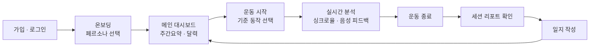
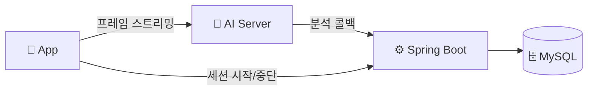

<div align="center">

# ShadowFit — Frontend (React Native / Expo)

**카메라로 찍은 내 운동 자세를, 정답 동작과 실시간으로 비교해주는 홈트레이닝 앱의 클라이언트.**

</div>

---

## 이 레포에 대해

[ShadowFit](https://github.com/SMU-2026-1-capstone-project)은 3인 팀 캡스톤 프로젝트(React Native + Spring Boot + FastAPI)입니다. 이 레포는 그 팀 프로젝트의 개인 포크로, **프론트엔드(React Native) 모듈**을 담고 있습니다. 이 레포는 [Shadowfit/init](https://github.com/Shadowfit/init) 모노레포의 `frontend/` 모듈이 자동으로 미러링된 것이며, 전체 구조는 [조직 프로필](https://github.com/Shadowfit)을 참고하세요.

---

## 📖 사용자 여정



1. **가입 & 온보딩** — 이메일로 회원가입 후, 온보딩에서 페르소나(헬린이·헬창·다이어트·재활)를 선택합니다.
2. **메인 대시보드** — 이번 주 운동 요약(총 운동시간·칼로리·요일별 그래프)과 달력으로 최근 운동 현황을 확인합니다.
3. **운동 시작** — 운동(현재는 스쿼트)을 선택하면 등록된 기준 동작을 기준으로 세션이 시작됩니다.
4. **실시간 분석** — 카메라로 촬영한 프레임을 AI 서버로 스트리밍하고, 실시간 싱크로율과 음성 피드백을 받습니다.
5. **운동 종료 & 결과 확인** — 세션 리포트에서 취약 구간과 직전 세션 대비 변화를 확인합니다.
6. **기록 남기기** — 오늘의 운동에 메모와 기분을 남깁니다.

## 🧩 아키텍처에서의 위치



카메라 프레임은 AI 서버로 직접 스트리밍하고, 세션 시작/중단만 Spring을 거칩니다. 음성 피드백은 서버가 내려주는 멘트를 device TTS(`expo-speech`)로 재생합니다.

## 실행 방법

```bash
npm install
npx expo start
```

## 주요 기능

- 카메라로 운동 자세 촬영 및 AI 서버로 실시간 프레임 스트리밍
- 온보딩 페르소나(헬린이·헬창·다이어트·재활) 선택 — 페르소나별 피드백 톤 반영
- 캘린더/리포트 화면에서 세션별 싱크로율·취약 구간·이전 세션 대비 변화 조회
- device TTS(`expo-speech`) 기반 음성 운동 피드백 재생
- JWT 인증 연동 (로그인/온보딩)

## 🛠 기술 스택


**Device 기능**: expo-camera, expo-av, expo-speech(TTS), expo-secure-store, react-native-chart-kit, react-native-calendars

---

<div align="center">

팀 프로젝트 원본은 [SMU-2026-1-capstone-project](https://github.com/SMU-2026-1-capstone-project)에서 확인할 수 있습니다.

</div>
